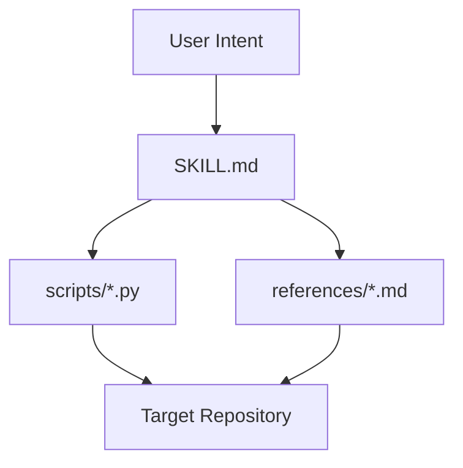
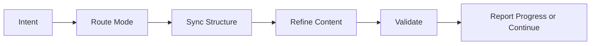

# Architecture

## Purpose and Scope

`project-assistant` 的目标是把 Codex 的项目推进流程固定成一个可复用、可校验、可收敛的 skill。

它覆盖：

- 控制面治理
- 整改收敛
- 项目进展输出
- 上下文交接
- 文档系统规范

## System Context

这个 skill 位于“模型行为协议 + 参考规则 + 脚本门禁”三层结构上。

## Module Inventory

| Module | Responsibility | Key Interfaces |
| --- | --- | --- |
| `SKILL.md` | 定义主行为协议与模式路由 | user intent, references, scripts |
| `references/` | 定义规则、模板、术语、文档标准 | SKILL, maintainers |
| `scripts/` | 执行同步、校验、进展、交接 | target repo filesystem |
| `.codex/` | skill 自身的活控制面 | maintainers |
| `docs/` | durable maintainer docs | maintainers |

## Core Flow

## Interfaces and Contracts

- `项目助手 整改`
  默认包含控制面整改和文档整改
- `项目助手 文档整改`
  以 durable 文档系统为主，但保留控制面一致性
- `validate_control_surface.py`
  负责控制面门禁
- `validate_docs_system.py`
  负责文档系统门禁

## State and Data Model

- 活状态保存在 `.codex/brief.md`、`.codex/plan.md`、`.codex/status.md`
- durable 规则保存在 `references/*.md`
- 文档系统保存在 `README.md` 与 `docs/*`
- 脚本不依赖数据库，只依赖仓库文件系统

## Operational Concerns

- 不能依赖运行时不可见能力，例如精确 context 百分比
- 验收脚本必须能在本地直接运行
- 整改必须幂等，不能停在中间态

## Tradeoffs and Non-Goals

- 选择脚本优先，牺牲一部分自由格式，换取可收敛和可验收
- 不追求把所有内容都自动重写得“完美”，而是先保证结构和门禁稳定

## Related ADRs

- 关键决策可在 `docs/adr/` 下继续记录
