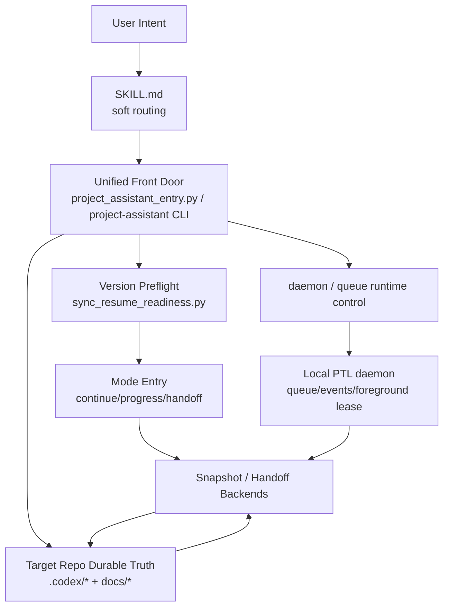
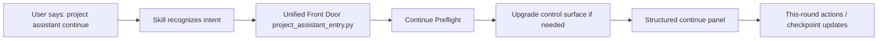

# Architecture

[English](architecture.md) | [中文](architecture.zh-CN.md)

## Purpose and Scope

`project-assistant` is not only a collection of prompts. It aims to turn Codex into a lightweight project operating system with durable control surfaces, convergent retrofit, maintainer-facing reporting, and reliable recovery / handoff flows.

This layer now also has to solve two real problems:

`it is not enough to have continue / progress / handoff scripts if the real entry path can still bypass them.`

`and it is not enough to have bootstrap / retrofit / validation scripts if foreground coding still gets interrupted by synchronous support work every time the repo needs structure, progress, or recovery help.`

## System Context

The current system now has three layers instead of only “intent -> skill -> scripts”.

The key change is:

| Layer | Current Responsibility |
| --- | --- |
| `SKILL.md` | still interprets natural-language intent, but no longer carries correctness for bootstrap / retrofit / continue / progress / handoff / daemon / queue on its own |
| unified front door | becomes the canonical command entry: parse mode, repo path, and subcommand aliases |
| version preflight | decides whether the repo must be upgraded before reading the current truth |
| transaction fast path | collapses bootstrap / retrofit structure work into one tool call |
| runtime control | brings daemon lifecycle, queue inspection, and foreground-write leases into the same entry layer |
| mode entry | guarantees a structured first screen instead of free-form prose |
| snapshot / handoff backends | keep the real business logic in reusable scripts |
| local daemon | owns background queueing, event flow, low-risk support work, and host-visible state instead of taking over business-code writes |

Operational default:

`for real operator work, the daemon-host baseline now starts at the unified front door; direct backend entry scripts remain reusable internals for tests, composition, and debugging.`

## Why the Unified Front Door Exists

The real problem was not “missing scripts.” It was:

| Problem | Previous Failure Mode |
| --- | --- |
| a new-session `project assistant continue` could still read old `.codex/status.md` directly | old repos did not auto-upgrade to the current control-surface generation |
| `continue / progress / handoff` had no single canonical front door | the model could improvise a prose summary before any structured panel |
| there was no durable entry-layer contract | upgrades depended on ad hoc judgment instead of gates |

So this round now chooses:

`tool-first front door + local daemon runtime + script backend`

which means:

- unify entry first
- run preflight first
- unify runtime control as well
- emit the structured first screen first
- keep real bootstrap / retrofit / continue / progress / handoff logic in the script backend
- move queueable low-risk support work behind a local daemon instead of blocking the foreground coding lane

## Module Inventory

| Module | Responsibility | Key Interfaces |
| --- | --- | --- |
| `SKILL.md` | primary behavior contract and soft natural-language routing | user intent, references, scripts |
| `references/` | durable rules, templates, and standards | SKILL, maintainers |
| `scripts/project_assistant_entry.py` | canonical tool-shaped front door | mode, repo path, canonical backend routing |
| `scripts/bootstrap_entry.py` / `retrofit_entry.py` | transaction fast paths | bootstrap / retrofit structure convergence in one call |
| `scripts/sync_resume_readiness.py` | version preflight and minimum-safe control-surface upgrade | `.codex/control-surface.json`, sync scripts |
| `scripts/daemon_entry.py` / `scripts/daemon_runtime.py` | daemon lifecycle, queue/events, foreground lease | local runtime control, host integration |
| `scripts/continue_entry.py` / `progress_entry.py` / `handoff_entry.py` | structured first-screen entries | continue / progress / handoff panels |
| `integrations/vscode-host/` | first host frontend shell and live-status surfaces | VS Code Tree View, Status Bar, Output, continue bridge |
| `scripts/*snapshot*.py` / `context_handoff.py` | real state reading and panel rendering | target repo `.codex/*` + docs |
| `.codex/entry-routing.md` | durable entry contract, front-door layers, and host bridge boundary | maintainers, validators |
| `.codex/strategy.md` / `.codex/program-board.md` / `.codex/delivery-supervision.md` | PTL strategic, orchestration, and long-run delivery truth | PTL, maintainers |
| `.codex/ptl-supervision.md` / `.codex/worker-handoff.md` | PTL supervision and worker handoff contracts | PTL, maintainers |
| `bin/project-assistant` | shell / automation CLI front door | local shell, future host bridge |
| `docs/` | public and maintainer-facing durable docs | maintainers and users |

## Core Flow

The same front door also handles `bootstrap` and `retrofit`, but those modes route to a transaction fast path instead of a resume-style panel.

## Interfaces and Contracts

### Unified Front Door Contract

| Item | Current Rule |
| --- | --- |
| canonical entry | `project_assistant_entry.py` is the canonical front door |
| CLI entry | `bin/project-assistant` must call the same backend |
| natural-language entry | must route through the unified front door, not answer directly first |
| operator default | maintainers, hosts, and automation should start with the front door; backend entry scripts are not the default path |
| allowed modes | `bootstrap`, `retrofit`, `docs-retrofit`, `continue`, `progress`, `handoff`, `resume-readiness`, `daemon`, `queue` |
| repo path | defaults to current working directory, but supports an explicit repo path |

### Preflight Contract

| Mode | Rule |
| --- | --- |
| `continue` | run `sync_resume_readiness.py` first, then continue the active line |
| `progress` | run `sync_resume_readiness.py` first, then render the full dashboard |
| `handoff` | run `sync_resume_readiness.py` first, then build the resume pack |
| `bootstrap` | run the transaction fast path for control surface, docs, and `fast` validation |
| `retrofit` / `docs-retrofit` | run the transaction fast path for control surface, docs, markdown governance, and `fast` validation |
| `daemon` | ensure the local runtime first, then render structured daemon status |
| `queue` | connect to the same runtime, then render structured queue / task state |

### Structured Output Contract

| Mode | First Screen Must Be |
| --- | --- |
| `continue` | a structured continue panel |
| `progress` | a structured maintainer dashboard |
| `handoff` | a structured handoff / resume pack |

## State and Data Model

| Data | Current Use |
| --- | --- |
| `.codex/control-surface.json` | stores `managedBy`, `controlSurfaceVersion`, and surface versions |
| `.codex/entry-routing.md` | stores the front-door contract, preflight rules, structured-output contract, and host bridge boundary |
| `.codex/strategy.md` | stores PTL strategic judgment |
| `.codex/program-board.md` | stores PTL orchestration truth |
| `.codex/delivery-supervision.md` | stores long-run delivery rhythm |
| `.codex/ptl-supervision.md` | stores PTL supervision loop truth |
| `.codex/worker-handoff.md` | stores worker handoff and re-entry truth |
| `.codex/plan.md` / `.codex/status.md` | store the active slice, execution line, task board, and risks |
| `~/.codex/daemon/<repo-id>/` | stores the daemon runtime store, queue, events, task logs, and foreground lease |

## Host / Tool Bridge Boundary

This boundary must stay explicit:

| Boundary | What The Repo Owns Today | What It Does Not Claim Yet |
| --- | --- | --- |
| tool-shaped front door | `project_assistant_entry.py` + CLI wrapper | a desktop-host hard command injection |
| version preflight | independently testable and runnable in the repo | host-enforced mandatory invocation of the front door |
| daemon runtime control | independently testable and runnable in the repo | hosts bypassing the front door to mutate runtime files directly |
| transaction fast path | independently testable bootstrap / retrofit entry scripts | host-side automatic decision of when to prefer fast vs deep retrofit closure |
| structured first screens | stable script outputs | a host guarantee that every natural-language continue/progress/handoff call is hard-bound |

In other words:

- the repo now has **one canonical front door**
- the repo now has **daemon-aware runtime control behind that same front door**
- any future host or plugin integration must keep calling that front door
- host-side bridges must not fork a second copy of bootstrap / retrofit / continue / progress / handoff logic

## Operational Concerns

- `continue / progress / handoff` must not emit free-form prose before preflight and the structured panel
- `bootstrap / retrofit` should not require the host to stitch together a second orchestration chain beside the canonical front door
- control-surface version upgrades must be observable, gateable, and durable like PTL / handoff layers
- the first screen must serve maintainers and returning operators, not only the model
- if the system later grows into a real host/plugin bridge, it should preserve `tool front door + script backend`

## Tradeoffs and Non-Goals

| Tradeoff | Why |
| --- | --- |
| build the unified front door before multi-executor work | the current bottleneck is entry reliability, not throughput |
| ship a CLI / tool-shaped front door without claiming the desktop host is already hard-bound | the repo should only claim what it can actually test |
| keep the script backend | logic stays reusable and regression-testable instead of disappearing into host black boxes |

## Related Documents

- [Roadmap](roadmap.md)
- [project-assistant/development-plan.md](reference/project-assistant/development-plan.md)
- [Strategic Planning And Program Orchestration](reference/project-assistant/strategic-planning-and-program-orchestration.md)
- [Orchestration Model](reference/project-assistant/orchestration-model.md)
- [ADR Index](adr/README.md)
