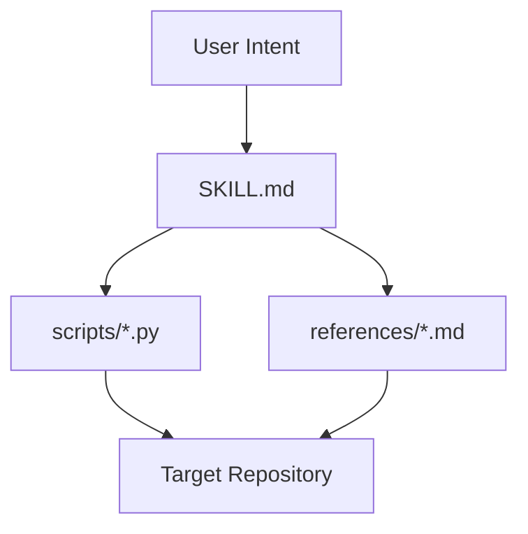
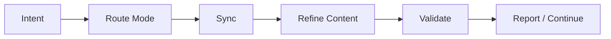

# Architecture

[English](architecture.md) | [中文](architecture.zh-CN.md)

## Purpose and Scope

`project-assistant` turns Codex into a lightweight project operating system with explicit control surfaces, convergent retrofit, progress reporting, and context handoff.

## System Context

The skill sits between user intent, durable rules, and executable validation scripts.

## Module Inventory

| Module | Responsibility | Key Interfaces |
| --- | --- | --- |
| `SKILL.md` | primary behavior contract and mode routing | user intent, references, scripts |
| `references/` | durable rules, templates, and standards | SKILL, maintainers |
| `scripts/` | structure sync, validation, progress, and handoff | target repo filesystem |
| `.codex/` | live state for this skill repo | maintainers |
| `docs/` | public and maintainer-facing durable docs | maintainers and users |

## Core Flow

## Interfaces and Contracts

- `项目助手 整改`
  includes control-surface retrofit and documentation retrofit by default
- `项目助手 文档整改`
  focuses on durable docs while preserving control-surface correctness
- `validate_control_surface.py`
  enforces control-surface gates
- `validate_docs_system.py`
  enforces durable-doc structure gates
- `validate_public_docs_i18n.py`
  enforces bilingual public-doc pairs and switch links

## State and Data Model

- live state lives in `.codex/brief.md`, `.codex/plan.md`, `.codex/status.md`
- durable rules live in `references/*.md`
- public docs live in `README*.md` and `docs/*`
- scripts operate only on repository files; no database is required

## Operational Concerns

- the skill must not claim runtime capabilities it cannot observe directly
- retrofit must be idempotent and fail closed
- public docs must stay readable and bilingual where required

## Tradeoffs and Non-Goals

- script-first structure sacrifices some formatting freedom to gain convergence and validation
- the system optimizes for stable structure first, then narrative polish

## Related ADRs

- see [ADR Index](adr/README.md)
