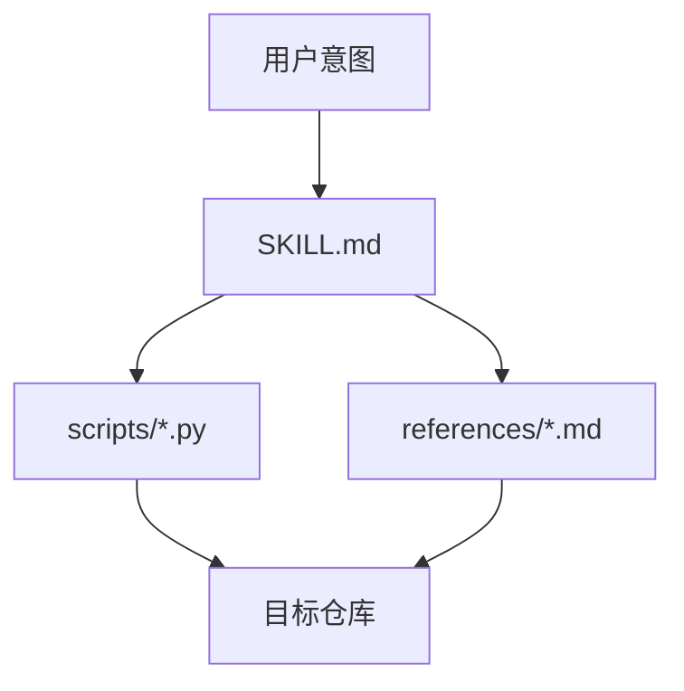

# 架构

[English](architecture.md) | [中文](architecture.zh-CN.md)

## 目的与范围

`project-assistant` 的目标是把 Codex 固化成一个轻量的项目操作系统，覆盖控制面、整改收敛、进展汇报和上下文交接。

## 系统上下文

这个 skill 位于“用户意图、durable 规则、可执行校验脚本”三层之间。

## 模块清单

| 模块 | 职责 | 关键接口 |
| --- | --- | --- |
| `SKILL.md` | 主行为协议与模式路由 | user intent, references, scripts |
| `references/` | 持久规则、模板、标准 | SKILL, maintainers |
| `scripts/` | 结构同步、校验、进展、交接 | target repo filesystem |
| `.codex/` | 当前 skill 仓库的活状态 | maintainers |
| `docs/` | 对外与维护者可见的 durable 文档 | maintainers and users |

## 核心流程

## 接口与契约

- `项目助手 整改`
  默认包含控制面整改和文档整改
- `项目助手 文档整改`
  重点放在 durable 文档，但不破坏控制面一致性
- `validate_control_surface.py`
  负责控制面门禁
- `validate_docs_system.py`
  负责 durable 文档结构门禁
- `validate_public_docs_i18n.py`
  负责公开文档双语成对文件和切换入口门禁

## 状态与数据模型

- 活状态保存在 `.codex/brief.md`、`.codex/plan.md`、`.codex/status.md`
- durable 规则保存在 `references/*.md`
- 公开文档保存在 `README*.md` 和 `docs/*`
- 脚本只依赖仓库文件系统，不依赖数据库

## 运维关注点

- skill 不能声称拥有无法直接观测的运行时能力
- 整改必须幂等并且 fail closed
- 当要求双语时，公开文档必须可切换

## 取舍与非目标

- 采用脚本优先的结构，会牺牲一部分格式自由度，换来收敛与验收
- 当前优先保证结构稳定，再提升叙事美感

## 相关 ADR

- 参见 [ADR 索引](adr/README.zh-CN.md)
