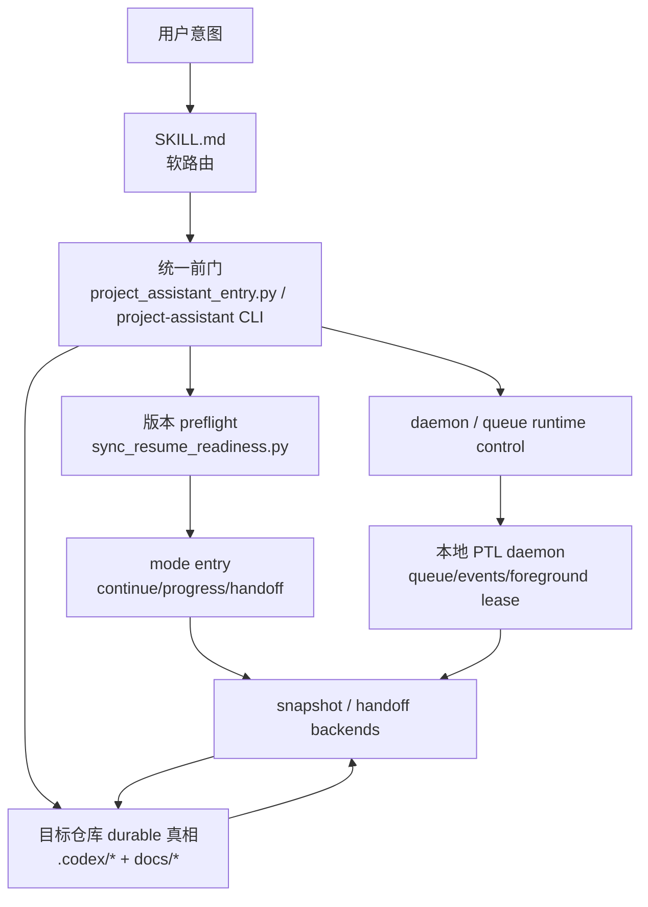

# 架构

[English](architecture.md) | [中文](architecture.zh-CN.md)

## 目的与范围

`project-assistant` 的目标不是只提供一堆 prompt，而是把 Codex 收敛成一个轻量的项目操作系统：它要有 durable 控制面、可校验的整改与交付流程、维护者可读的进展面板，以及可靠的恢复与交接入口。

当前这层架构还要额外解决两个真实问题：

`只把 continue / progress / handoff 做成脚本还不够；如果真实入口还能绕过这些脚本，用户仍会看到错误代际、自由 prose 和漂移的恢复行为。`

`而如果空白项目初始化、整改、验证和恢复都还要前台同步串很多步骤，用户的主编码线就会一直被支撑性工作打断。`

## 系统上下文

当前系统不再只由“用户意图 -> skill -> scripts”组成，而是分成三层：

这里的关键变化是：

| 层 | 当前职责 |
| --- | --- |
| `SKILL.md` | 继续负责理解自然语言意图，但不再独自承载 `启动 / 整改 / 继续 / 进展 / 交接 / daemon / queue` 的正确性保证 |
| `统一前门` | 成为真正的命令入口：解析模式、仓库路径、子命令别名，并把请求路由到唯一后端 |
| `版本 preflight` | 在读取旧控制面前，先决定仓库是不是需要自动升级到当前控制面代际 |
| `事务化快路径` | 把 bootstrap / retrofit 的结构同步收成一次工具调用，减少宿主串脚本的等待 |
| `runtime control` | 把 daemon 生命周期、队列查询和前台主写入线 lease 也收进同一条入口 |
| `mode entry` | 负责结构化第一屏，不再允许先掉回自由 prose |
| `snapshot / handoff backends` | 继续负责真实业务逻辑：读取 `.codex/*`、汇总状态、输出面板 |
| `本地 daemon` | 负责后台队列、事件流、低风险支撑任务和宿主可见状态，而不是接管业务代码主写入线 |

当前默认操作语义：

`对真实维护者工作来说，daemon-host baseline 现在默认从统一前门进入；直接调用后端 entry scripts 仍然可复用，但只作为测试、组合和调试入口。`

## 为什么要新增统一前门

当前真实问题不是“脚本没有”，而是：

| 问题 | 之前的后果 |
| --- | --- |
| 新 session 里的 `项目助手 继续` 可能直接读旧 `.codex/status.md` | 旧项目不会先升级到最新控制面代际 |
| `continue / progress / handoff` 没有唯一前门 | 模型可能直接自由发挥，输出一大段 prose |
| 没有 durable 的入口层控制面 | 版本升级只能靠临时判断，不能像 PTL / handoff 一样被门禁要求 |

所以这轮的架构取舍已经变成：

`tool-first front door + local daemon runtime + script backend`

也就是：

- 入口先统一
- 版本先检查
- runtime 控制也先统一
- 第一屏先结构化
- 真正的启动 / 整改 / 继续 / 进展 / 交接逻辑仍留在脚本后端
- 低风险支撑任务尽量经由本地 daemon 在后台运行，而不是继续卡住前台写代码路径

## 模块清单

| 模块 | 职责 | 关键接口 |
| --- | --- | --- |
| `SKILL.md` | 主行为协议与自然语言软路由 | user intent, references, scripts |
| `references/` | durable 规则、模板、标准 | SKILL, maintainers |
| `scripts/project_assistant_entry.py` | 统一工具前门 | mode, repo path, canonical backend routing |
| `scripts/bootstrap_entry.py` / `retrofit_entry.py` | 事务化快路径 | bootstrap / retrofit 在一次调用内完成结构收敛 |
| `scripts/sync_resume_readiness.py` | 版本 preflight 与最小安全升级 | `.codex/control-surface.json`, sync scripts |
| `scripts/daemon_entry.py` / `scripts/daemon_runtime.py` | daemon 生命周期、queue/events、foreground lease | local runtime control, host integration |
| `scripts/continue_entry.py` / `progress_entry.py` / `handoff_entry.py` | 结构化第一屏入口 | continue/progress/handoff structured panels |
| `integrations/vscode-host/` | 第一宿主前端壳与 live status 面 | VS Code Tree View, Status Bar, Output, continue bridge |
| `scripts/*snapshot*.py` / `context_handoff.py` | 真实状态读取与面板渲染 | target repo `.codex/*` + docs |
| `.codex/entry-routing.md` | durable 的入口契约、前门层次与宿主桥接边界 | maintainers, validators |
| `.codex/strategy.md` / `.codex/program-board.md` / `.codex/delivery-supervision.md` | PTL 的战略、编排与长期监督真相 | PTL, maintainers |
| `.codex/ptl-supervision.md` / `.codex/worker-handoff.md` | worker 停下后的监督和接续 contract | PTL, maintainers |
| `bin/project-assistant` | shell / automation 可调用的 CLI 前门 | local shell, future host bridge |
| `docs/` | 对外与维护者可见的 durable 文档 | maintainers and users |

## 核心流程

同一条前门现在也负责 `启动` 和 `整改`，只是这两个 mode 会路由到事务化快路径，而不是恢复式面板。

## 接口与契约

### 统一前门契约

| 项目 | 当前约束 |
| --- | --- |
| 统一入口 | `project_assistant_entry.py` 是 canonical front door |
| CLI 入口 | `bin/project-assistant` 调用同一条后端 |
| 自然语言入口 | 必须路由到统一前门，而不是直接自由回答 |
| 维护者默认入口 | 宿主、CLI、自动化与维护者都应优先走统一前门；后端 entry scripts 不再是默认路径 |
| 允许的 mode | `bootstrap`、`retrofit`、`docs-retrofit`、`continue`、`progress`、`handoff`、`resume-readiness`、`daemon`、`queue` |
| 仓库路径 | 默认取当前工作目录，也允许显式传 repo path |

### preflight 契约

| mode | 规则 |
| --- | --- |
| `continue` | 先升级控制面版本，再恢复当前执行线 |
| `progress` | 先升级控制面版本，再出完整看板 |
| `handoff` | 先升级控制面版本，再出交接包 |
| `bootstrap` | 直接进入 control-surface + docs + `fast` gate 的事务化快路径 |
| `retrofit` / `docs-retrofit` | 直接进入 control-surface + docs + markdown governance + `fast` gate 的事务化快路径 |
| `daemon` | 先 ensure 本地 runtime，再输出结构化 daemon 状态 |
| `queue` | 连接同一 runtime，并输出结构化 queue / task 状态 |

### 结构化输出契约

| mode | 第一屏必须先输出什么 |
| --- | --- |
| `continue` | 结构化 continue 面板 |
| `progress` | 结构化 maintainer dashboard |
| `handoff` | 结构化 handoff / resume 包 |

## 状态与数据模型

| 数据 | 当前用途 |
| --- | --- |
| `.codex/control-surface.json` | 记录 `managedBy`、`controlSurfaceVersion` 和各 surface 版本 |
| `.codex/entry-routing.md` | 记录统一前门、preflight、结构化输出和宿主桥接边界 |
| `.codex/strategy.md` | 记录 PTL 的战略判断 |
| `.codex/program-board.md` | 记录 PTL 的程序编排真相 |
| `.codex/delivery-supervision.md` | 记录长期监督交付节奏 |
| `.codex/ptl-supervision.md` | 记录 PTL 监督环 |
| `.codex/worker-handoff.md` | 记录 worker 接续与回流 |
| `.codex/plan.md` / `.codex/status.md` | 当前 active slice、执行线、任务板与风险 |
| `~/.codex/daemon/<repo-id>/` | 记录 daemon runtime store、queue、events、task logs 与 foreground lease |

## 宿主 / 工具桥接边界

这条边界必须写清楚：

| 边界 | repo 现在拥有什么 | 还没有拥有什么 |
| --- | --- | --- |
| tool-shaped front door | `project_assistant_entry.py` + CLI wrapper | 真实桌面宿主的硬命令注入 |
| version preflight | 已可在 repo 内独立验证与执行 | 宿主自动强制调用这条前门 |
| daemon runtime control | 已可在 repo 内独立验证与执行 | 宿主直接绕过前门去操纵 runtime store |
| structured entry panels | 已由后端脚本稳定产出 | 宿主层保证“任何自然语言 continue 都不能绕过它” |

换句话说：

- repo 现在已经有**唯一前门**
- repo 现在已经有**daemon-aware runtime control**
- 宿主未来如果要做更硬的工具注入，也必须继续复用这条前门
- 不能让插件或宿主再复制一套新的 `bootstrap / retrofit / continue / progress / handoff` 逻辑

## 运维关注点

- `继续 / 进展 / 交接` 不能再先自由发挥，再去解释为什么没升级控制面
- `启动 / 整改` 也不应再依赖宿主手工拼一条平行脚本链
- 控制面版本升级必须像 PTL / handoff 一样可观察、可校验、可门禁
- 结构化第一屏必须优先服务维护者和回归接手者，而不是只服务模型自己
- 如果将来扩到真正的插件或宿主硬接入，仍应保持 `tool front door + script backend` 这一分层

## 取舍与非目标

| 取舍 | 原因 |
| --- | --- |
| 先做统一前门，不直接做多执行器 | 当前最大缺口是入口可靠性，不是吞吐 |
| 先做 CLI / tool-shaped front door，不声称宿主已硬绑定 | repo 可以交付的部分必须真实、可验证 |
| 仍保留 script backend | 逻辑可回归、可在 shell/CI 单独验证，不把能力埋进宿主黑箱 |

## 相关文档

- [路线图](roadmap.zh-CN.md)
- [project-assistant/development-plan.zh-CN.md](reference/project-assistant/development-plan.zh-CN.md)
- [业务规划与程序编排方向](reference/project-assistant/strategic-planning-and-program-orchestration.zh-CN.md)
- [编排模型](reference/project-assistant/orchestration-model.zh-CN.md)
- [ADR 索引](adr/README.zh-CN.md)
