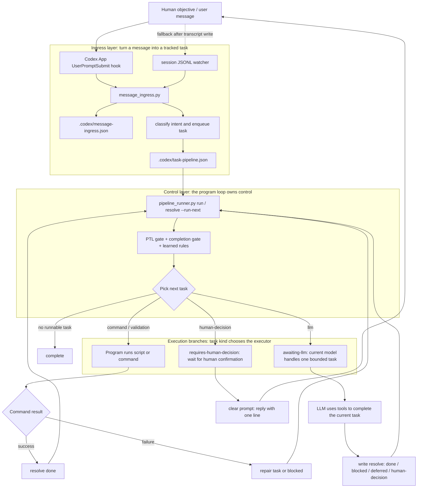

# Codex App Loop Method Validation

[English](codex-app-loop-methods.md) | [中文](codex-app-loop-methods.zh-CN.md)

## Purpose

This document only covers one premise: keep using Codex Desktop App. It does not count the CLI wrapper or the VS Code extension as primary methods.

The target project-assistant path is:

`user message -> Codex App observable ingress -> message ingress -> task pipeline -> bounded LLM task -> checkpoint / blocker / human decision / completion gate`

## Decision

Use two successful ingress paths plus one behavioral support layer:

- Primary ingress: Codex `UserPromptSubmit` hook records the prompt into `.codex/message-ingress.json` and enqueues `.codex/task-pipeline.json`.
- Fallback ingress: Codex App session JSONL watcher records messages after the App writes `~/.codex/sessions/**/*.jsonl`.
- Durable runtime: macOS LaunchAgent keeps the watcher running outside any single Codex turn.
- Behavioral support: `~/.codex/AGENTS.md` is only a model-behavior constraint, not physical interception.

## Task Invocation Logic

Read the diagram this way:

- Outer control belongs to `pipeline_runner.py`, not to the LLM deciding whether it feels like continuing.
- The LLM only works inside an `llm` task branch; after the task, it must write back `resolve` and return control to the runner.
- Human confirmation is not an out-of-loop chat wait. It is a `human-decision` task.
- The hook is the supported Codex App prompt-submit ingress; the watcher is the fallback after transcript write.



Shortest interpretation:

| Question | Answer |
| --- | --- |
| Does every user message enter the loop | In a hook-loaded Codex App session, yes synchronously; the watcher is the asynchronous fallback |
| Is the LLM the loop controller | No. The LLM is the executor for an `llm` task |
| Who decides the next step | `pipeline_runner.py`, using task state, gates, failures, and human-decision state |
| When does it stop | complete, blocked, requires-human-decision, explicitly-deferred, or no runnable task |
| Where is human confirmation | A `human-decision` task; after confirmation, state is written back and control returns to the runner |

## Human-Facing Loop Header

Every project-assistant reply should start with a compact loop header before doing work:

```text
Current loop: <task id or active gate>.
Goal: <what this turn is trying to complete>.
Current state: <running / waiting for human / complete / idle>.
Human action: <what is needed, or "none needed">.
```

This is not just status text. It makes the controller visible to the human so the user can tell whether the assistant is executing, waiting for confirmation, blocked, or complete.

If there is no active task and no human-decision, do not keep prompting for `stop` or `pause`; that implies a loop still needs handling. Instead write:

```text
Current state: idle, no active task.
Human action: none needed.
```

Only include stop, pause, or decision reply formats when work is still running, waiting, blocked, or actually needs human judgment.

If the current state needs human action, append a separate section:

```text
## 需要人类做什么

1. <action 1>
2. <action 2>

You can reply directly with:
`<short copyable reply>`

Pending:
1. <current pending item>
2. <current pending item>
```

Restate this section every time. Do not say "as above" or depend on previous-turn context.

## Five Tested Codex App Paths

| # | Method | Covers App chat | Verification | Decision |
| --- | --- | --- | --- | --- |
| 1 | Codex `UserPromptSubmit` hook | yes, at prompt submission | Official hooks docs define `prompt/cwd/turn_id`; local `codex app-server generate-json-schema` includes `UserPromptSubmit`; `validate_codex_app_loop.py` proves stdin prompt -> message ingress -> task pipeline | primary ingress |
| 2 | Codex App session JSONL watcher | yes, asynchronously after transcript write | local `~/.codex/sessions/**/*.jsonl` contains `event_msg/user_message`; fixture routes into `.codex/message-ingress.json`; validator covers dedupe and trusted project routing | fallback ingress |
| 3 | macOS LaunchAgent watcher runtime | yes, by keeping the watcher alive | installer fixture writes a plist that runs `codex_app_loop.py watch`; `install_codex_app_loop.py --status` reports installed/loaded state | durable runtime |
| 4 | App state/log SQLite observation | partially, metadata only | `~/.codex/state_5.sqlite` exposes thread metadata such as `cwd`, `rollout_path`, and `first_user_message`; `logs_2.sqlite` is lower-level telemetry | reject as primary |
| 5 | Bundled `app-server` / proxy boundary | not reliably | Desktop App runs long-lived `/Applications/Codex.app/Contents/Resources/codex app-server`; proxy/schema exist, but no stable external before-send middleware was found | reject as primary |

## Method 1: `UserPromptSubmit` Hook

Codex hooks are the supported lifecycle mechanism. See [OpenAI Codex hooks](https://developers.openai.com/codex/hooks) and the [Codex config reference](https://developers.openai.com/codex/config-reference). The official docs state that hooks can be loaded from `~/.codex/hooks.json` or inline `[hooks]` config, `features.codex_hooks` enables hook loading, and `UserPromptSubmit` runs when the user prompt is about to be sent.

The installed hook shape is:

```json
{
  "hooks": {
    "UserPromptSubmit": [
      {
        "hooks": [
          {
            "type": "command",
            "command": "python3 /Users/redcreen/.codex/skills/project-assistant/scripts/codex_app_user_prompt_hook.py",
            "timeoutSec": 10,
            "async": false,
            "statusMessage": "Project Assistant loop ingress"
          }
        ]
      }
    ]
  }
}
```

`codex_app_user_prompt_hook.py`:

- reads Codex hook JSON from stdin
- resolves the target project-assistant repo from `cwd`
- calls `message_ingress.ingest(..., source="codex-app-user-prompt-hook")`
- returns `UserPromptSubmit.additionalContext` so the model knows the current turn is already inside the bounded task loop

Validation command:

```bash
python3 scripts/validate_codex_app_loop.py . --format text
```

Covered behavior:

- Codex-shaped stdin payload
- `.codex/message-ingress.json` write
- `.codex/task-pipeline.json` enqueue
- hook stdout JSON shape

## Method 2: Session JSONL Watcher

Codex Desktop App writes session transcripts. The watcher reads:

- `session_meta.payload.cwd`
- `event_msg.payload.type == "user_message"`
- `event_msg.payload.message`

`codex_app_loop.py scan/watch` scans recent sessions, resolves the target repo, dedupes recent messages, calls message ingress, and updates `.codex/codex-app-loop.json`.

Boundary:

- This is an asynchronous fallback after transcript write.
- It cannot prevent the model from taking its first action before the watcher sees the message.
- It must complement the `UserPromptSubmit` hook, not replace it.

## Method 3: LaunchAgent Runtime

`install_codex_app_loop.py` installs:

- `~/.codex/AGENTS.md` prompt front door
- `~/.codex/hooks.json` `UserPromptSubmit` hook
- `~/.codex/config.toml` `features.codex_hooks = true`
- `~/Library/LaunchAgents/com.redcreen.project-assistant.codex-app-loop.plist`

The LaunchAgent runs:

```bash
python3 /Users/redcreen/.codex/skills/project-assistant/scripts/codex_app_loop.py watch --quiet
```

Validation command:

```bash
python3 scripts/install_codex_app_loop.py --status
```

Boundary:

- LaunchAgent is not a separate message source.
- It solves the runtime durability problem for the watcher.

## Method 4: State / Log SQLite

Local Codex App state includes:

- `~/.codex/state_5.sqlite`
- `~/.codex/logs_2.sqlite`

These can expose thread metadata, current cwd, rollout path, first user message, and lower-level logs.

Rejected because:

- `state_5.sqlite` is thread metadata, not a stable per-message ingress contract.
- `logs_2.sqlite` is noisy and not a project-assistant contract.
- This layer is useful for debugging and cross-checking, not as the main message ingress chain.

## Method 5: App-Server / Proxy Boundary

Desktop App starts a long-lived app-server:

```text
/Applications/Codex.app/Contents/Resources/codex app-server --analytics-default-enabled
```

Rejected because:

- The process is not a per-message command boundary.
- `app-server proxy` is better suited to debugging or remote control than before-send middleware.
- Patching or replacing bundled app internals is fragile and can be overwritten by App updates.
- Official hooks already provide the supported pre-send path.

## Current Boundary

Now supported:

- In Codex App sessions with hooks loaded, every prompt submission can enter project-assistant message ingress automatically.
- If hooks are not loaded yet, the session watcher still records messages after transcript write.
- The hook-injected context includes the `pipeline_runner.py resolve` protocol; after completing an LLM task, the model must write back `done / blocked / requires-human-decision / explicitly-deferred`, and `--run-next` can return control to the program loop for follow-up command/validation tasks.
- continue/progress panels surface Codex App Loop signal.

Still true:

- An already-running Codex App process may need a new window or restart to load newly written hook config.
- `AGENTS.md` is a behavioral constraint, not a physical guarantee.
- `resolve --run-next` guarantees programmatic continuation after an LLM task; it does not make a closed Codex App continue coding in the background.
- Governed learning and rule review/accept/reject/snooze are the next layer, separate from message ingress.
