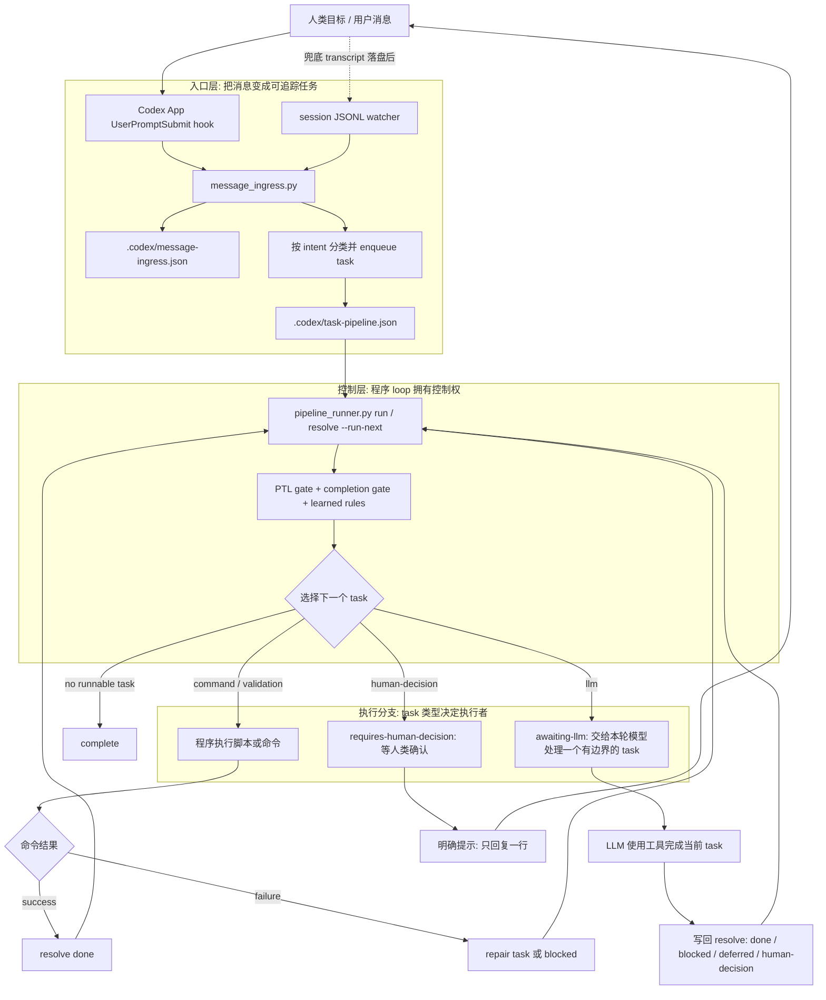

# Codex App Loop 方法验证

[English](codex-app-loop-methods.md) | [中文](codex-app-loop-methods.zh-CN.md)

## 目的

这份文档只讨论一个前提：继续使用 Codex Desktop App，不切换到 CLI wrapper，也不把 VS Code 扩展当作主入口。

目标是把 project-assistant 消息进入程序化 loop：

`用户消息 -> Codex App 可观察入口 -> message ingress -> task pipeline -> 有边界的 LLM task -> checkpoint / blocker / human decision / completion gate`

## 结论

采用两层成功路径和一层行为提示：

- 主入口：Codex `UserPromptSubmit` hook，在 prompt 提交时把消息写入 `.codex/message-ingress.json` 并入队 `.codex/task-pipeline.json`。
- 兜底入口：Codex App session JSONL watcher，在 App 写入 `~/.codex/sessions/**/*.jsonl` 后异步补录消息。
- 持久运行：macOS LaunchAgent 常驻运行 watcher，避免依赖某一次 Codex 回合。
- 行为提示：`~/.codex/AGENTS.md` 只作为模型行为约束，不再把它描述成物理拦截。

## 任务调用逻辑图

这张图的关键读法：

- 外层控制权属于 `pipeline_runner.py`，不是 LLM 自己决定要不要继续。
- LLM 只在 `llm` task 分支里工作；完成后必须写回 `resolve`，再回到 runner。
- 人类确认不是 loop 外的聊天等待，而是 `human-decision` task。
- hook 是 Codex App 支持的 prompt-submit 入口；watcher 是 transcript 落盘后的兜底入口。



最短理解：

| 问题 | 答案 |
| --- | --- |
| 每条用户消息是否进入 loop | 在 hook 已加载的 Codex App 会同步进入；watcher 负责异步兜底 |
| LLM 是不是 loop 控制器 | 不是。LLM 是 `llm` task 的执行者 |
| 谁决定下一步 | `pipeline_runner.py` 根据 task 状态、gate、失败结果和人类确认状态决定 |
| 什么时候停 | complete、blocked、requires-human-decision、explicitly-deferred，或没有可运行 task |
| 人类确认在哪里 | `human-decision` task，确认后写回状态并回到 runner |

## 面向人类的 Loop 开头协议

每次 project-assistant 回复在开始做事前，都应该先给一个紧凑的 loop 头：

```text
当前 loop：<task id 或 active gate>。
目标：<本轮要完成什么>。
当前状态：<执行中 / 等待人类 / 已完成 / 空闲>。
人类动作：<需要做什么，或写“无需操作”>。
```

这不是普通状态文字，而是把控制器显式暴露给人类。人类应该一眼知道助手是在执行、等待确认、阻塞，还是已经完成。

如果当前没有 active task，也没有 human-decision，不要继续提示 `停止` / `暂停`，因为这会让人误以为还有一个待处理 loop。应明确写：

```text
当前状态：空闲，没有 active task。
人类动作：无需操作。
```

只有在工作仍在执行、等待、阻塞或需要人类决策时，才给退出、暂停或决策回复格式。

如果当前需要人类做动作，必须继续追加一个独立区块：

```text
## 需要人类做什么

1. <动作 1>
2. <动作 2>

你可以直接回复：
`<最短可复制回复>`

待确认：
1. <当前 pending item>
2. <当前 pending item>
```

这个区块每次都要重新列清楚，不能只说“如上”或依赖上一轮上下文。

## 五种 Codex App 前提下的实测路径

| # | 方法 | 是否覆盖 App chat | 实测证据 | 结论 |
| --- | --- | --- | --- | --- |
| 1 | Codex `UserPromptSubmit` hook | 是，提交 prompt 时触发 | 官方 hooks 文档说明该事件输入包含 `prompt/cwd/turn_id`，本机 `codex app-server generate-json-schema` 含 `UserPromptSubmit`，`validate_codex_app_loop.py` 的 hook fixture 已把 stdin prompt 写入 message ingress 和 task pipeline | 选为主入口 |
| 2 | Codex App session JSONL watcher | 是，但在 App 落盘后异步触发 | 本机 `~/.codex/sessions/**/*.jsonl` 存在 `event_msg/user_message`；fixture session 可路由到 `.codex/message-ingress.json`；验证覆盖去重和 trusted project 路由 | 选为兜底入口 |
| 3 | macOS LaunchAgent 常驻 watcher | 是，保障 watcher 脱离单次回合运行 | installer fixture 写入可运行 `codex_app_loop.py watch` 的 plist；`install_codex_app_loop.py --status` 可报告 loaded/installed 状态 | 选为持久运行层 |
| 4 | App state/log SQLite 观察 | 部分覆盖，只能识别 thread/rollout/日志 | `~/.codex/state_5.sqlite` 有 `threads(cwd, rollout_path, first_user_message)`；`logs_2.sqlite` 更偏低层 telemetry，不是稳定 per-message front door | 不作为主入口 |
| 5 | App bundled `app-server` / proxy 边界 | 不稳定，不是 per-message 边界 | Desktop App 进程为长生命周期 `/Applications/Codex.app/Contents/Resources/codex app-server`；`app-server --help` 暴露 proxy/schema，但没有稳定外部 before-send API；hook 才是受支持机制 | 拒绝作为主入口 |

## 方法 1：`UserPromptSubmit` Hook

Codex hooks 是受支持的生命周期机制。参考：[OpenAI Codex hooks](https://developers.openai.com/codex/hooks) 和 [Codex config reference](https://developers.openai.com/codex/config-reference)。官方文档记录：

- hooks 可来自 `~/.codex/hooks.json` 或 inline `[hooks]` 配置。
- `features.codex_hooks` 用于启用 hooks。
- `UserPromptSubmit` 在用户 prompt 即将发送时运行。
- hook handler 从 stdin 接收 JSON，输出 JSON 可追加 `additionalContext`。

本项目安装的 hook：

```json
{
  "hooks": {
    "UserPromptSubmit": [
      {
        "hooks": [
          {
            "type": "command",
            "command": "python3 /Users/redcreen/.codex/skills/project-assistant/scripts/codex_app_user_prompt_hook.py",
            "timeoutSec": 10,
            "async": false,
            "statusMessage": "Project Assistant loop ingress"
          }
        ]
      }
    ]
  }
}
```

`codex_app_user_prompt_hook.py` 做四件事：

- 从 stdin 读取 Codex hook JSON。
- 用 `cwd` 找到 project-assistant repo 或 trusted project。
- 调用 `message_ingress.ingest(..., source="codex-app-user-prompt-hook")`。
- 返回 `UserPromptSubmit.additionalContext`，提醒当前回合已经进入 bounded task loop。

验证：

```bash
python3 scripts/validate_codex_app_loop.py . --format text
```

覆盖项：

- Codex 形状的 stdin payload。
- `.codex/message-ingress.json` 写入。
- `.codex/task-pipeline.json` 任务入队。
- hook stdout JSON 结构。

## 方法 2：Session JSONL Watcher

Codex Desktop App 会写 session transcript。watcher 从 transcript 中读取：

- `session_meta.payload.cwd`
- `event_msg.payload.type == "user_message"`
- `event_msg.payload.message`

`codex_app_loop.py scan/watch` 会：

- 读取近期 session JSONL。
- 根据 control surface 或 trusted project 解析目标 repo。
- 对近期重复消息去重。
- 调用 message ingress 入队。
- 更新 repo 面板 `.codex/codex-app-loop.json`。

边界：

- 它是落盘后的异步兜底，不能阻止 App 在 watcher 看到消息前先让模型开始动作。
- 因此它必须配合 `UserPromptSubmit` hook，而不能单独作为主方案。

## 方法 3：LaunchAgent 常驻运行

`install_codex_app_loop.py` 会安装：

- `~/.codex/AGENTS.md` 的提示词前门。
- `~/.codex/hooks.json` 的 `UserPromptSubmit` hook。
- `~/.codex/config.toml` 的 `features.codex_hooks = true`。
- `~/Library/LaunchAgents/com.redcreen.project-assistant.codex-app-loop.plist`。

LaunchAgent 运行：

```bash
python3 /Users/redcreen/.codex/skills/project-assistant/scripts/codex_app_loop.py watch --quiet
```

验证：

```bash
python3 scripts/install_codex_app_loop.py --status
```

边界：

- LaunchAgent 不是新的消息源，它是 watcher 的持久运行机制。
- 它解决的是“Codex 回合结束后 watcher 不能持续工作”的问题。

## 方法 4：State / Log SQLite

本机 Codex App 存在：

- `~/.codex/state_5.sqlite`
- `~/.codex/logs_2.sqlite`

可观察到 thread、cwd、rollout path、first user message 和部分低层日志。

拒绝原因：

- `state_5.sqlite` 更像 thread metadata，不是每条用户消息的稳定入口。
- `logs_2.sqlite` 噪声更高，schema 不是 project-assistant 可依赖的 contract。
- 适合 debug 和交叉验证，不适合作为 message ingress 主链路。

## 方法 5：App-Server / Proxy 边界

Desktop App 启动的是长生命周期 app-server：

```text
/Applications/Codex.app/Contents/Resources/codex app-server --analytics-default-enabled
```

拒绝原因：

- 这个进程不是“每条用户消息启动一次”的边界。
- `app-server proxy` 更适合调试或远程控制，不是公开稳定的 before-send middleware。
- patch 或替换 App 内部二进制会被 App 更新覆盖，风险高。
- 官方 hooks 已经提供了受支持的前置入口，因此不应该绕过 hooks 去 patch app-server。

## 当前边界

现在能做到：

- 在 Codex App 支持 hooks 的前提下，用户 prompt 提交时自动进入 project-assistant message ingress。
- 如果 hook 未加载或当前 App 进程未刷新配置，session watcher 仍会在 transcript 落盘后兜底补录。
- hook 注入的上下文会携带 `pipeline_runner.py resolve` 写回协议；LLM task 完成后必须写回 `done / blocked / requires-human-decision / explicitly-deferred`，并可用 `--run-next` 回到程序 loop 继续执行后续 command/validation task。
- continue/progress 面板展示 Codex App Loop signal。

仍需注意：

- 当前已经运行中的 Codex App 进程可能需要重新打开窗口或重启 App 才能加载新写入的 hooks 配置。
- `AGENTS.md` 是行为约束，不是物理保证。
- `resolve --run-next` 能保证 LLM task 之后的程序化继续；它不能让关闭的 Codex App 后台自写代码。
- 自动学习和规则 review/accept/reject/snooze 是下一层能力，不应和消息入口混为一谈。
