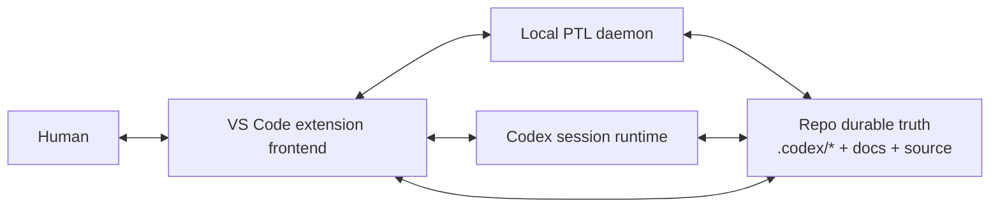
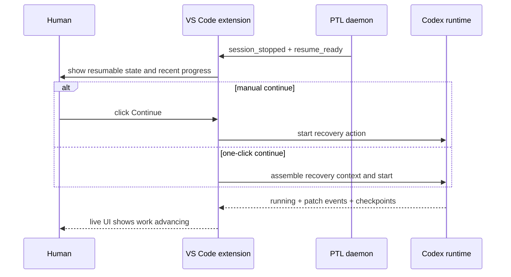

# Host Resume Bridge And VS Code Extension Feasibility

[English](host-resume-bridge.md) | [中文](host-resume-bridge.zh-CN.md)

## Purpose

This note defines the layer that still sits above the daemon:

`host resume bridge`

It answers two questions:

- when the daemon sees that the current Codex run stopped but work may continue, who wakes up the next execution action?
- if the first host target is a VS Code extension, can it realistically carry that recovery and live-status experience?

## What "Host" Means

The `host` is not the repo and not the daemon.

It is the application layer that carries the Codex session and UI, for example:

- a CLI shell
- a VS Code extension
- a desktop app
- a web frontend

Today the repo owns:

- durable truth
- the front door
- mode backends
- the PTL daemon design

Today the repo does not own:

- session heartbeat
- live UI updates
- resume buttons
- host-level control over how the next execution is started

## Desired User Experience

What the user actually wants is not “a daemon exists in the background.”

The desired experience is:

1. the human keeps coding or watching progress in the IDE
2. the daemon keeps background support work running and decides when the system is `resume-ready`
3. if the current Codex run stops but the current gate still allows progress, the host catches that event
4. the frontend can show that the page is moving, code is changing, and work is still advancing
5. resume behavior evolves from manual continue to one-click continue, and only later to auto-resume if trust allows it

## One-Line Boundary

Recommended boundary:

`the daemon detects and decides; the host wakes and renders; the repo remains the durable source of truth.`

Do not treat “programmatically type continue into a chat input” as the main architecture.

## Capability Levels

### Level 1: manual continue

- the daemon detects `resume-ready`
- the host shows a clear state and button
- the user clicks `Continue`
- the host starts the recovery action

### Level 2: one-click continue

- the daemon detects `resume-ready`
- the host offers one-click recovery
- the host assembles handoff / continue context automatically
- the user does not need to rebuild the prompt manually

### Level 3: auto-resume

- the daemon detects `resume-ready`
- the host starts the next execution according to policy
- the frontend keeps showing live status, ETA, file changes, and recent patches

The first version should aim for Level 1 or a conservative Level 2, not treat Level 3 as a launch requirement.

## Why "Type Continue Into The Chat Box" Is Not The Right Default

That path is not rejected because it is impossible. It is rejected because it is brittle:

- it depends on UI structure and focus
- it depends on OS automation permissions
- it is hard to reliably target the correct window, session, and input box
- it makes the architecture depend on fragile page automation

So it can only be a last-resort fallback, not the mainline.

## Is VS Code Extension A Good First Host?

Conclusion:

`yes, and it is the most realistic first host candidate.`

But the recommended shape is not “take over the built-in chat box.”

It is:

`make the VS Code extension the host frontend for project-assistant / Codex.`

That means:

- the extension starts or connects to the local daemon
- the extension renders queue, status, ETA, and recent changes
- the extension turns `resume-ready` into a button, command, or controlled auto-resume action
- the extension may integrate with chat surfaces, but must not depend on controlling the built-in chat textbox

## Recommended Architecture

## What The VS Code Extension Needs To Carry

### 1. Status presentation

- a queue view in the Activity Bar / Sidebar
- short global status in the Status Bar
- an Output / Log panel with event flow
- an optional richer dashboard in a Webview

### 2. Host bridge

- connect to the daemon socket for the repo
- receive heartbeat, checkpoint, `resume-ready`, failure, and completion events
- surface notifications, buttons, and quick actions

### 3. Resume coordination

- when Codex stops and work may continue, decide whether to:
  - ask for manual continue
  - offer one-click continue
  - auto-resume when policy allows

### 4. Change visualization

- show which files changed recently
- show diff / patch summaries
- show the active slice, ETA, and recent checkpoints
- make it obvious that the system is actually moving

## VS Code Capability Assessment

| Need | VS Code extension feasibility | Notes |
| --- | --- | --- |
| show background queue and task tree | high | Tree View / View Container are a strong fit |
| show a richer dashboard | high | Webview View can carry a real-time panel |
| show discreet global progress | high | Status Bar guidance explicitly covers background progress |
| watch workspace file changes | high | `createFileSystemWatcher` can monitor code and `.codex` changes |
| expose cancel / retry actions | high | Commands + QuickPick + view actions are enough |
| connect to daemon socket and keep local runtime state | high | desktop extensions can run in a Node.js extension host |
| one-click continue | medium | feasible, but the recovery action must be clearly defined |
| auto-resume | medium | technically possible, but trust, duplicate sessions, and race conditions must be handled carefully |
| directly type "continue" into the built-in chat box | low | no stable documented API found; this looks like UI automation fallback, not product architecture |
| take over an existing built-in chat session | low-medium | official chat participants, tools, and CLI exist, but I did not find a stable API for injecting prompts into another already running chat session |

## Two Implementation Paths

### Path A: the extension as its own host frontend

This is the recommended path.

Characteristics:

- the extension owns its queue view, status panel, and resume actions
- recovery flows through extension commands or a local runtime launcher
- the frontend can be designed directly around daemon / Codex runtime events
- it does not depend on the structure of the built-in chat textbox

Advantages:

- highest control
- clearest live status
- best fit for the “page is moving, code is changing” experience

Tradeoff:

- we must design our own frontend interaction instead of reusing chat as the only UI

### Path B: the extension integrates with VS Code AI / chat surfaces

This is also viable, but better treated as a second-layer enhancement.

Available directions:

- a custom chat participant such as `@project-assistant`
- custom slash commands such as `/continue` and `/progress`
- language model tools that expose project-assistant capabilities to agent mode

Advantages:

- more native to VS Code AI UX
- users can interact through `@project-assistant`

Problem:

- this creates a new participant or tool path
- it is not the same as stably taking over an existing built-in chat session
- I did not find a documented stable API for writing directly into the built-in chat input or injecting a continue prompt into another participant's existing session

So this path is better treated as an enhancement entry, not the primary recovery chain.

## Recommended First VS Code Host Scope

Keep the first scope narrow:

- desktop VS Code only
- local workspace only
- support `manual continue` and conservative `one-click continue`
- no promise of web / Codespaces / remote development in v1
- no promise of “write continue directly into the chat box”

## Recommended VS Code Frontend Shape

### Minimum UI

- one Sidebar Tree View for queue, active slice, status, and recent files
- one Status Bar item for `running / waiting / resume-ready / blocked`
- one Output / Log channel for daemon and resume events

### Optional richer UI

- one Webview dashboard for ETA, recent patches, checkpoints, and diff summaries
- one notification entry point for one-click continue when `resume-ready` appears

## Recommended Resume Sequence

## Most Important Judgment

### What is ready to build

- stop detection
- `resume-ready` judgment
- VS Code queue / status / ETA / event presentation
- recent patch / changed-file visualization
- manual or one-click continue

### What should not be the first bet

- direct control of the built-in chat input
- reliance on undocumented internal chat commands
- full web / remote / Codespaces coverage from the first release

## Conclusion

The most stable direction is:

`treat the VS Code extension as the real host frontend that connects to the daemon, renders live status, and provides continue/resume actions, instead of treating it as a shell that only types into a chat box.`

## Feasibility Summary

| Topic | Judgment |
| --- | --- |
| VS Code extension as the first host | viable and recommended |
| live status rendering | highly feasible |
| manual continue / one-click continue | feasible |
| auto-resume | feasible with careful rollout |
| auto-typing "continue" into chat | not recommended as the mainline |

## Official Basis

The assessment above is grounded in official VS Code documentation:

- Chat overview: VS Code already supports local, background, and cloud chat/agent flows, plus sessions, checkpoints, and edit review  
  https://code.visualstudio.com/docs/copilot/chat/copilot-chat
- CLI `code chat`: the official CLI can start a chat session and accept a prompt  
  https://code.visualstudio.com/docs/configure/command-line
- Chat Participant API: extensions can contribute participants, slash commands, follow-ups, and streaming chat output  
  https://code.visualstudio.com/api/extension-guides/ai/chat
- Language Model Tool API: extensions can contribute structured tools to agent mode  
  https://code.visualstudio.com/api/extension-guides/ai/tools
- Tree View API: extensions can render task/state trees in the sidebar  
  https://code.visualstudio.com/api/extension-guides/tree-view
- Webview API: extensions can render richer dashboards  
  https://code.visualstudio.com/api/extension-guides/webview
- Extension Host: desktop extensions can run in a Node.js extension host, while web/remote have extra constraints  
  https://code.visualstudio.com/api/advanced-topics/extension-host
- Status Bar UX: the status bar is an approved place for discreet background progress  
  https://code.visualstudio.com/api/ux-guidelines/status-bar

## Note On Unsupported Parts

I did not find a documented stable extension API for directly writing a prompt into the built-in chat input or for injecting a continue prompt into another already-running chat session.

So that part of the design should currently be treated as:

`unsupported by the documented public API, and therefore not suitable as the main architecture.`
