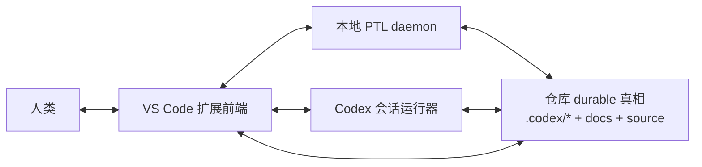
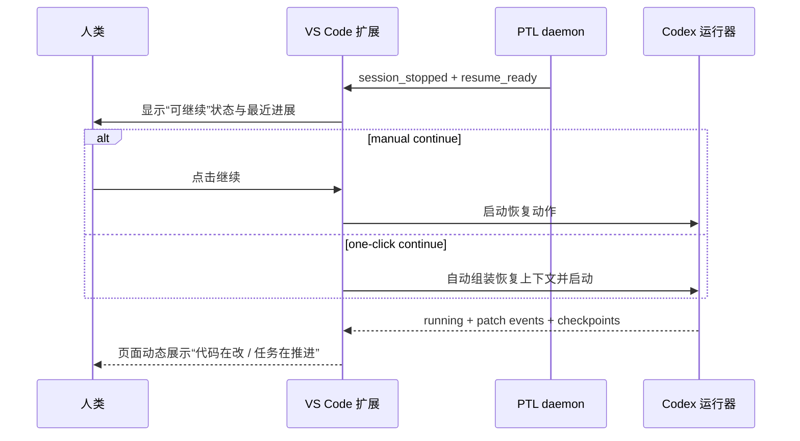

# 宿主恢复桥与 VS Code 扩展可行性

[English](host-resume-bridge.md) | [中文](host-resume-bridge.zh-CN.md)

## 目的

这份说明定义 `daemon` 之外还缺的那一层：

`host resume bridge`

它回答两个问题：

- 当 daemon 发现当前 Codex 停了，但项目还能继续时，谁来唤起下一个执行动作？
- 如果第一宿主选型是 VS Code 扩展，它到底能不能承接这种恢复与动态展示体验？

当前状态：

`M17-M21` 已经把这条宿主恢复桥以 VS Code 宿主壳 + continue bridge 的形式落成首版 baseline；接下来的主线是稳定化和 dogfooding，而不是回到“宿主能不能做”的抽象讨论。

当前实现边界也已经比较明确：

- 在 VS Code 里打开当前 workspace 的精确 Codex 会话，已经是 host baseline 的一部分
- 新线程 auto-resume 已经可以通过公开的 `chatgpt.implementTodo` bridge 自动提交
- 精确会话 auto-submit 目前仍是实验性的本机 macOS bridge，因为公开的 Codex API 还没有稳定提供“向这个已有会话直接发一条 prompt”

## 什么叫宿主

这里的 `宿主` 不是仓库，也不是 daemon。

它是承载 Codex 会话与前端展示的那一层应用，例如：

- 终端里的 CLI 壳
- VS Code 扩展
- 桌面 App
- 网页前端

repo 自己今天拥有的是：

- durable 真相
- 统一前门
- mode 后端脚本
- PTL daemon 设计

repo 今天还不拥有的是：

- 会话 heartbeat
- UI 动画与动态状态展示
- 会话恢复按钮
- 自动唤起下一次执行的宿主级控制能力

## 目标体验

用户真正要的不是“后台有个 daemon 在跑”。

用户要的是：

1. 人类继续在 IDE 里写代码或观察进度
2. daemon 在后台持续跑支撑任务并判断是否 `resume-ready`
3. 如果当前 Codex 停了，但当前 gate 允许继续，宿主能接住这件事
4. 前端能显示“页面在动、代码在改、任务在推进”
5. 恢复动作尽量从“手动敲继续”升级到“一键继续”，再视情况升级到“自动继续”

## 一句话边界

推荐边界是：

`daemon 负责检测与判断；宿主负责唤起与展示；repo 继续负责 durable 真相。`

不推荐把“往聊天输入框里自动打一行 继续”当成主架构。

## 能力分级

### Level 1: manual continue

- daemon 检测 `resume-ready`
- 宿主前端显示明确状态和按钮
- 用户点击 `继续`
- 宿主再启动恢复动作

### Level 2: one-click continue

- daemon 检测 `resume-ready`
- 宿主直接提供一键恢复
- 宿主自动组装 handoff / continue 上下文
- 用户不需要自己重新组织 prompt

### Level 3: auto-resume

- daemon 检测 `resume-ready`
- 宿主按策略自动拉起下一次执行
- 前端持续显示 live 状态、ETA、文件变化和最近 patch

这里最后一步，今天实际上已经拆成两条具体桥：

- exact-session auto-resume 依赖和 `Resume Last Codex Session` 同一条 exact-session auto-submit bridge
- fresh-thread auto-resume 可以直接走公开的新线程 bridge，不依赖 exact-session 注入能力

首版建议先做到 Level 1 或保守的 Level 2，不把 Level 3 当首发门槛。

## 为什么不建议“往聊天框里写继续”

这条路的问题不是“完全不可能”，而是：

- 它依赖 UI 结构和焦点状态
- 它依赖系统级自动化权限
- 它很难稳定区分“当前窗口、当前 session、当前输入框”
- 它会把架构建立在易碎的页面自动化上

所以它最多只能是最后兜底，不应成为正式主路。

## VS Code 扩展是否适合作第一宿主

结论：

`适合，而且是当前最现实的第一宿主候选。`

但推荐形态不是“去接管 VS Code 内置聊天框”，而是：

`把 VS Code 扩展做成 project-assistant / Codex 的宿主前端。`

也就是：

- 扩展负责启动或连接本地 daemon
- 扩展负责展示队列、状态、ETA、最近改动
- 扩展负责把 `resume-ready` 变成按钮、命令或自动恢复动作
- 扩展可以选择接内置 chat 能力，但不应把“控制聊天输入框”当成唯一道路

## 推荐架构

## VS Code 扩展在这里要承接什么

### 1. 状态展示层

- Activity Bar / Sidebar 里的队列视图
- Status Bar 上的简短全局状态
- Output / Log 面板里的事件流
- 可选 Webview 里的 richer dashboard

### 2. 宿主桥接层

- 连接 repo 对应的 daemon socket
- 接收 heartbeat、checkpoint、`resume-ready`、失败、完成等事件
- 显示通知、按钮、快速操作

### 3. 恢复协调层

- 当 Codex 停下且可继续时，决定是：
  - 提醒用户手动继续
  - 提供一键继续
  - 在允许时自动继续

### 4. 变更可视化层

- 展示最近改了哪些文件
- 展示 diff / patch 摘要
- 展示当前 slice、ETA、最近 checkpoint
- 让用户感知到“系统真的在动”

## VS Code 官方能力与对应可行性

| 需求 | VS Code 扩展可行性 | 说明 |
| --- | --- | --- |
| 展示后台队列与任务树 | 高 | Tree View / View Container 很适合这类状态面 |
| 展示 richer dashboard | 高 | Webview View 可以承接实时面板 |
| 展示 discreet 全局进度 | 高 | Status Bar 官方建议就支持后台 progress 提示 |
| 监听工作区文件变化 | 高 | `createFileSystemWatcher` 可以监听代码和 `.codex` 变化 |
| 展示可取消、可重试操作 | 高 | Commands + QuickPick + View actions 足够 |
| 接 daemon socket、保本地状态 | 高 | 本地桌面版扩展可运行在 Node.js extension host |
| 一键继续 | 中 | 扩展命令可做，但要明确恢复动作到底是启动新 session 还是连接已有 runtime |
| 自动继续 | 中 | 技术上可做，但要处理重复 session、权限与用户信任 |
| 直接往内置聊天框里写“继续” | 低 | 没看到官方稳定 API；更像 UI 自动化兜底，不适合当主路 |
| 接管现有内置 chat session | 中低 | 官方有 chat participant / tool / CLI，但我没有找到稳定的“向别的现有会话注入 prompt”接口 |

## 两条实现路径

### 路径 A：扩展作为自己的宿主前端

这是推荐路线。

特点：

- 扩展拥有自己的队列视图、状态面板和恢复按钮
- 恢复动作走扩展命令或本地运行器
- 前端展示可以完全围绕 daemon / Codex runtime 来设计
- 不依赖内置聊天框结构

优点：

- 控制力最高
- 状态展示最清楚
- 最适合“页面在动、代码在改”的体验

代价：

- 需要自己设计一套前端交互
- 不是直接复用现成 chat UI

### 路径 B：扩展挂接 VS Code AI / chat 能力

这条路也可行，但推荐作为第二层增强，而不是第一版依赖。

可用方向：

- 自定义 chat participant，例如 `@project-assistant`
- 自定义 slash commands，例如 `/continue`、`/progress`
- 语言模型工具，给 agent mode 提供结构化 project-assistant 能力

优点：

- 更贴近 VS Code 原生 AI 体验
- 用户可以在 chat 里使用 `@project-assistant`

问题：

- 这更像“扩展出一个新的 participant”
- 不是“稳定接管现有某个聊天窗口并代替用户打字”
- 我没有找到官方稳定 API 来把 prompt 直接写入内置 chat 输入框，或向另一个已有 participant 的现成 session 直接注入继续指令

所以这条路更适合做增强入口，不适合承担主恢复链路。

## 推荐的第一版 VS Code 宿主范围

先把范围收窄到：

- 只做桌面版 VS Code
- 只做本地 workspace
- 只支持 `manual continue` 和保守的 `one-click continue`
- 不承诺 web / Codespaces / 远程开发
- 不承诺“直接往聊天框写继续”

## 推荐的 VS Code 前端构成

### 最小 UI

- 1 个 Sidebar Tree View：显示队列、当前 slice、状态、最近文件
- 1 个 Status Bar item：显示 `running / waiting / resume-ready / blocked`
- 1 个 Output / Log channel：显示 daemon 与 resume 事件流

### 可选增强 UI

- 1 个 Webview dashboard：显示 ETA、最近 patch、checkpoint、diff 摘要
- 1 个通知入口：当 `resume-ready` 出现时提供一键继续

## 建议的恢复时序

## 当前最重要的判断

### 可以做的

- daemon 停止检测
- `resume-ready` 判断
- VS Code 队列 / 状态 / ETA / 事件展示
- 最近 patch / 改动文件展示
- 手动或一键继续

### 不应当先押注的

- 直接控制内置 chat 输入框
- 依赖未文档化内部命令去操纵聊天 UI
- 一上来就要求 web / remote / Codespaces 全覆盖

## 结论

最稳的方向是：

`把 VS Code 扩展当成真正的 host front end，用它连接 daemon、展示 live 状态、提供 continue/resume 动作，而不是把它当成一个帮我们往聊天框里自动打字的壳。`

## 可行性结论

| 主题 | 判断 |
| --- | --- |
| VS Code 扩展作为第一宿主 | 可行，且推荐 |
| live 状态展示 | 高可行 |
| 手动继续 / 一键继续 | 可行 |
| 自动继续 | 可行但需保守 rollout |
| 聊天框自动写“继续” | 不推荐作为正式主路 |

## 官方依据

以下依据来自 VS Code 官方文档：

- Chat overview：VS Code 已支持本地、后台和云端 agent/chat 形态，并有 chat session / checkpoint / review 能力  
  https://code.visualstudio.com/docs/copilot/chat/copilot-chat
- CLI `code chat`：官方已支持从命令行启动 chat session，并可传 prompt  
  https://code.visualstudio.com/docs/configure/command-line
- Chat Participant API：扩展可注册自己的 chat participant、slash command、follow-up 和流式输出  
  https://code.visualstudio.com/api/extension-guides/ai/chat
- Language Model Tool API：扩展可给 agent mode 提供结构化工具  
  https://code.visualstudio.com/api/extension-guides/ai/tools
- Tree View API：扩展可在侧栏展示树状任务与状态  
  https://code.visualstudio.com/api/extension-guides/tree-view
- Webview API：扩展可提供 richer dashboard  
  https://code.visualstudio.com/api/extension-guides/webview
- Extension Host：桌面版扩展可以运行在 Node.js extension host；web/remote 有额外边界  
  https://code.visualstudio.com/api/advanced-topics/extension-host
- Status Bar UX：官方明确支持用状态栏展示 discreet progress  
  https://code.visualstudio.com/api/ux-guidelines/status-bar

## 说明

我没有在官方已文档化的扩展 API 中找到“向内置 chat 输入框直接写 prompt”或“接管另一个现成 chat session 并注入继续指令”的稳定接口。

因此，上面对这部分的判断是：

`基于已公开文档，当前应视为 unsupported / 不应作为主架构。`
