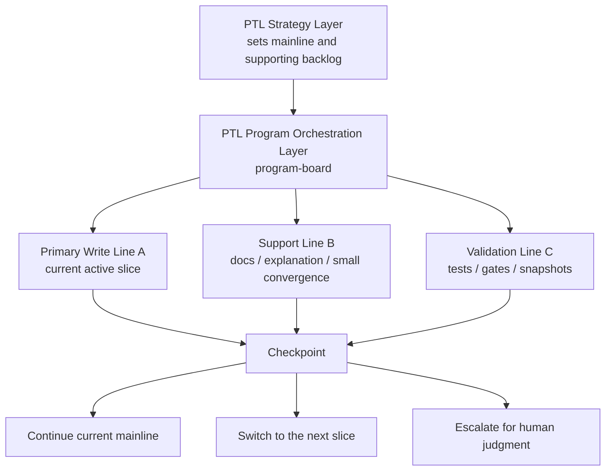
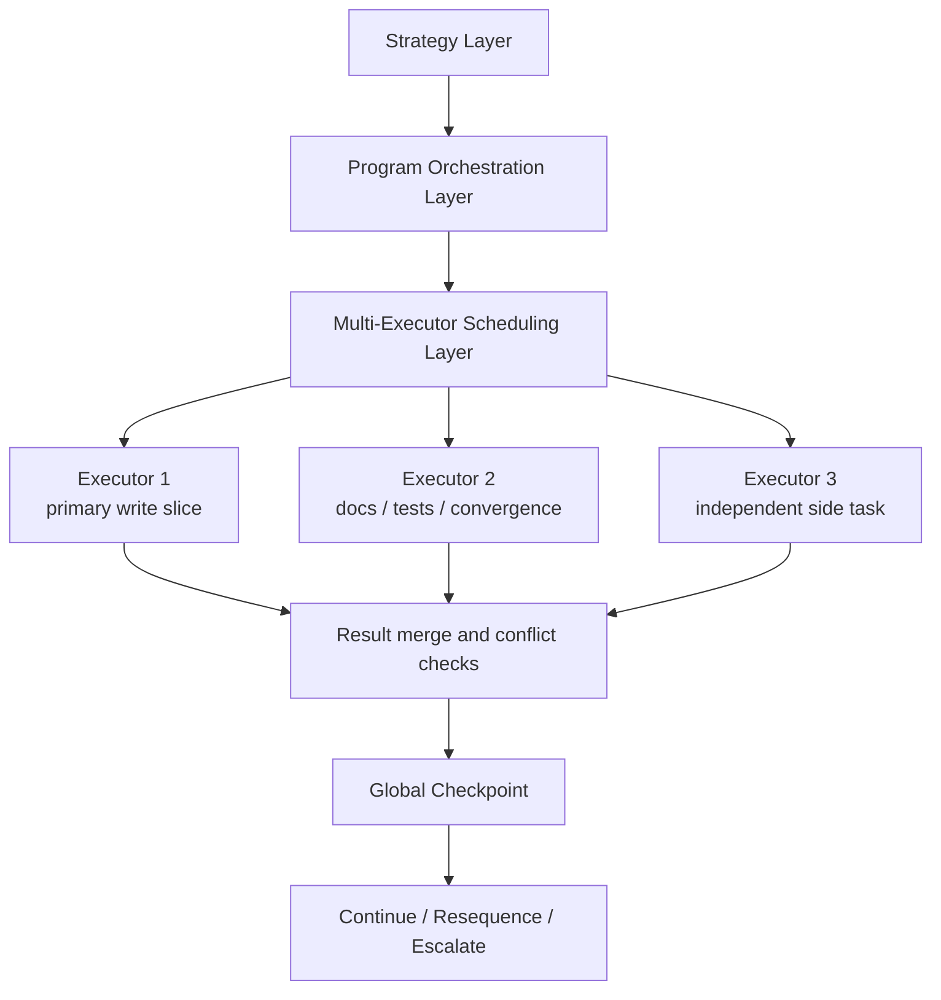

# Orchestration Model

[English](orchestration-model.md) | [中文](orchestration-model.zh-CN.md)

## Purpose

This document explains what `project-assistant` currently means by “orchestration,” and how that differs from a future multi-executor or multi-desktop-Codex scheduling layer.

It answers three main questions:

| Question | What This Document Clarifies |
| --- | --- |
| Can it already orchestrate multiple Codex sessions automatically? | Not yet; today it first stabilizes a durable single-Codex orchestration truth |
| Why does it already feel somewhat parallel? | Because it can manage multiple workstreams at once and parallelize safe read/validate/report work |
| Can I add a new task while another one is running? | Yes, but the system routes it differently depending on whether it is safe support work, same-boundary write work, or a direction-changing request |

## One-Line Definition

| Model | One-Line Meaning |
| --- | --- |
| Current model | a Project Technical Lead (PTL) inside one Codex acts like a coordinator that keeps several lines visible, while usually preserving one primary write line |
| Future model | multiple executors or multiple desktop Codex sessions are explicitly scheduled, assigned, and merged by a higher layer |

## Current Model: Durable Single-Codex Orchestration Truth

| Dimension | How It Works Today | Why It Was Designed This Way |
| --- | --- | --- |
| Strategic judgment | the PTL reads `.codex/strategy.md` to record the mainline, side-track insertion suggestions, and human review boundary | solve “where should this go next?” first |
| Program orchestration | the PTL reads `.codex/program-board.md` to record active workstreams, priority, serial/parallel boundaries, and next checkpoints | solve “which line comes first and which stays parked?” first |
| Long-run delivery | the PTL reads `.codex/delivery-supervision.md` to record checkpoint rhythm, auto-continue boundaries, and escalation timing | solve “when may the system keep going and when must it stop?” first |
| Current execution | `.codex/plan.md` and `.codex/status.md` keep the active slice, execution line, and task board aligned | preserve one write-oriented source of truth |

## What “Parallel” Means Today

| Parallel Type | Supported Now? | Current Real Meaning |
| --- | --- | --- |
| Cognitive parallelism | Yes | the system keeps the mainline, supporting backlog, and next checkpoints visible at the same time |
| Orchestration parallelism | Yes | multiple workstreams can be tracked simultaneously, with clear active / next / backlog state |
| Safe execution parallelism | Yes | file reads, tests, validators, and snapshot/report generation can run in parallel |
| Primary write parallelism | Limited | the system usually keeps one primary write line at a time to avoid collisions |
| Multi-desktop-Codex parallelism | No | “automatically spin up multiple desktop Codex sessions and merge results” is not yet a productized layer |

## Example: How One Codex Still Works “In Parallel”

Assume the current repo has three concurrent needs:

| Task | Type | How It Is Handled Today |
| --- | --- | --- |
| `A`: close runtime source-of-truth | primary write task | remains the active slice |
| `B`: update README / usage guide | supporting documentation task | sits on the program board and is usually absorbed at the current checkpoint |
| `C`: run tests / acceptance / drift checks | validation task | can run in parallel with reads, snapshots, and state refresh |

The system does not “forget B and C and only do A.” Instead:

| Layer | What Happens |
| --- | --- |
| Strategy | the PTL decides which of these is the mainline and which are supporting lines |
| Program orchestration | the PTL records A as active, B as checkpoint support work, and C as a validation line |
| Execution | keeps A as the primary write line, while still routing B and C into the same checkpoint |
| Delivery | refreshes docs, validation, status, and handoff together at the checkpoint |

## Diagram: Current Single-Codex Orchestration

## Can I Add a New Task While Another One Is Running?

| New Task Type | Can It Be Added? | How The Current Model Routes It |
| --- | --- | --- |
| file reads / validation / snapshots / small doc fixes | Yes | it can usually be attached to the current checkpoint and may run in parallel |
| work that touches the same files or the same architectural boundary | Yes, but usually not as an immediate concurrent write | it is first placed on the program board, then picked up after the current checkpoint closes |
| work that changes business direction, priority, or compatibility promises | Not automatically | it must be escalated for human review |

## Strengths And Limits Of The Current Model

| Dimension | Current Strength | Current Limit |
| --- | --- | --- |
| Stability | a single primary write line reduces conflict risk | true multi-instance throughput is not yet enabled |
| Recoverability | `strategy / program-board / plan / status / delivery-supervision` all remain durable | it still cannot automatically split one repo across several desktop Codex sessions |
| Explainability | maintainers can see why one line is active and why others are parked | if repo scale keeps growing, single-Codex orchestration may eventually hit its ceiling |

## Future Model: Multi-Executor / Multi-Desktop-Codex Scheduling

| Dimension | What A Future Multi-Executor Layer Would Add |
| --- | --- |
| executor assignment | decide which tasks are safe to hand to different executors |
| task dispatch | give each executor a bounded scope, write surface, and return channel |
| conflict control | detect when two executors would touch the same files or punch through the same boundary |
| result merge | merge multiple executor outputs back into one control truth |
| escalation rules | decide whether failed parallelism should be retried, serialized, or escalated |

## Diagram: Future Multi-Executor Scheduling

## Current Bottom Line

| Question | Current Answer |
| --- | --- |
| Does M11 already mean “multiple Codex instances automatically work together”? | No |
| What is M11’s real present value? | it stabilizes the PTL-driven durable orchestration truth for one Codex first |
| Why is it already stronger than “one task at a time”? | because it can manage several lines at once, parallelize safe work, and still preserve a single primary write line |
| Could it later grow into multi-executor scheduling? | yes, but only as a separate later layer justified by rollout evidence |

## Related Documents

- [strategic-planning-and-program-orchestration.md](strategic-planning-and-program-orchestration.md)
- [development-plan.md](development-plan.md)
- [../../roadmap.md](../../roadmap.md)
