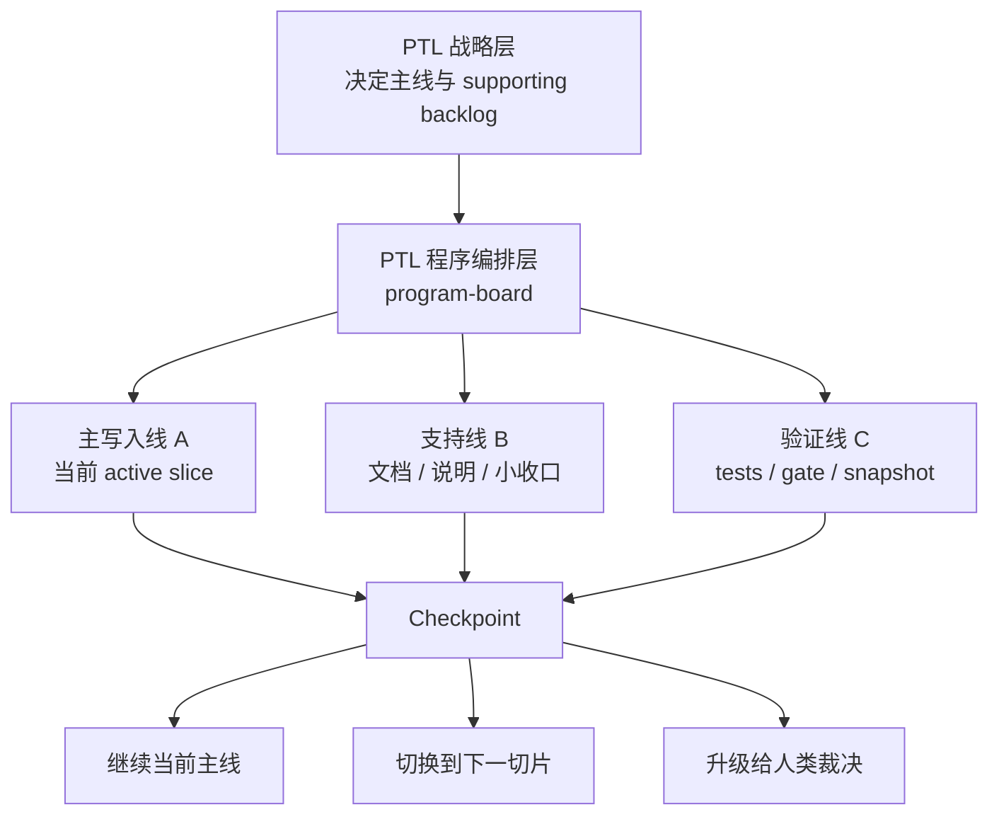
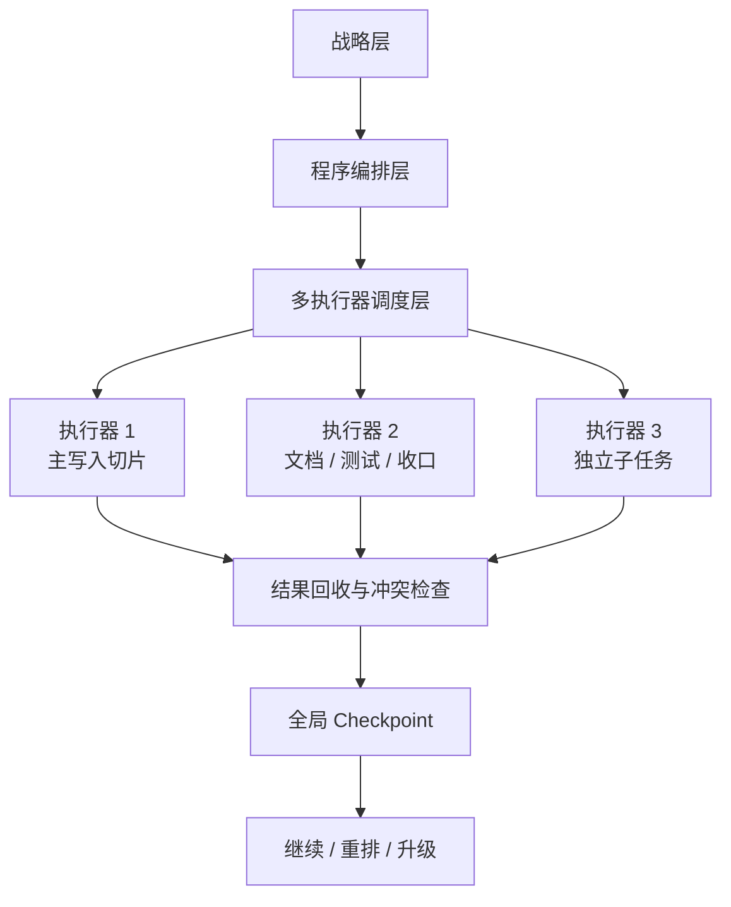

# 编排模型

[English](orchestration-model.md) | [中文](orchestration-model.zh-CN.md)

## 目的

这份文档解释 `project-assistant` 现在到底是如何“编排”工作的，以及它和未来可能出现的“多执行器 / 多桌面 Codex 调度层”有什么区别。

它主要回答 3 个问题：

| 问题 | 这份文档回答什么 |
| --- | --- |
| 现在是不是已经能自动调多个 Codex？ | 还没有；当前先稳定“单 Codex 的 durable 编排真相层” |
| 现在为什么看起来像能并行干活？ | 因为它能同时管理多条工作流，并把安全的读/验/汇报动作并行化 |
| 一个任务在跑时，还能不能新增任务？ | 可以，但会根据任务类型决定立即并入、挂入 checkpoint，还是升级给人类裁决 |

## 一句话定义

| 模型 | 一句话解释 |
| --- | --- |
| 当前模型 | 一个 Codex 里的项目技术负责人（PTL）像总协调者一样，持续管理多条线，但主写入线一次通常只保持一条 |
| 未来模型 | 多个执行器或多个桌面 Codex 被显式调度，并由更高层统一派发、回收和合并结果 |

## 当前模型：单 Codex 编排真相层

| 维度 | 当前怎么做 | 为什么这样设计 |
| --- | --- | --- |
| 战略判断 | 由 PTL 读取 `.codex/strategy.md`，记录主线、专项插入建议、需要人类裁决的边界 | 先解决“该往哪走” |
| 程序编排 | 由 PTL 读取 `.codex/program-board.md`，记录活跃 workstreams、优先级、串并行边界、下一检查点 | 先解决“先做哪条线、哪些暂时挂起” |
| 长期交付 | 由 PTL 读取 `.codex/delivery-supervision.md`，记录 checkpoint 节奏、自动继续边界、升级时机 | 先解决“什么时候自动继续、什么时候必须停” |
| 当前执行 | 用 `.codex/plan.md` 和 `.codex/status.md` 固定当前 active slice、执行线和任务板 | 让当前主写入线保持单一真相 |

## 当前“并行”到底是什么意思

| 并行类型 | 现在是否支持 | 当前真实含义 |
| --- | --- | --- |
| 认知并行 | 支持 | 同时保留主线、supporting backlog、下一检查点，不会只记住一个任务 |
| 编排并行 | 支持 | 同时维护多个 workstream，并明确哪个 active、哪个 next、哪个 backlog |
| 安全执行并行 | 支持 | 读文件、跑测试、跑 validator、生成快照这类安全动作可以并行 |
| 主写入并行 | 受限 | 当前通常只保持一条主写入线，避免多个修改面互相踩踏 |
| 多桌面 Codex 并行 | 不支持 | 还没有把“自动拉起多个桌面 Codex 并回收结果”做成正式能力 |

## 例子：一个 Codex 怎么“像并行一样工作”

假设当前仓库里同时有 3 件事：

| 任务 | 类型 | 当前处理方式 |
| --- | --- | --- |
| `A`：收口 runtime source-of-truth | 主写入任务 | 作为当前 active slice 持续推进 |
| `B`：补 README / usage_guide 说明 | 支持性文档任务 | 挂到 program board，通常在当前 checkpoint 一起收口 |
| `C`：跑 tests / acceptance / drift checks | 验证任务 | 可以和读取、快照、状态刷新并行跑 |

当前系统不是“忘掉 B 和 C，只做 A”，而是：

| 层 | 当前发生什么 |
| --- | --- |
| 战略层 | PTL 判断这 3 件事里谁是主线，谁只是支撑 |
| 程序编排层 | PTL 记录 A 为 active、B 为 checkpoint 内支撑项、C 为验证线 |
| 执行层 | 主写入仍以 A 为主，但在合适时点把 B、C 一起接进来 |
| 交付层 | 到 checkpoint 时一起刷新 docs、验证、状态与 handoff |

## 图示：当前单 Codex 编排

## 如果一个任务已经在跑，还能新增任务吗

| 新任务类型 | 能不能加 | 当前怎么处理 |
| --- | --- | --- |
| 读文件 / 验证 / 快照 / 文档小修 | 可以 | 可以直接挂进当前 checkpoint，必要时并行跑 |
| 与当前主线相关，但会改同一批文件或边界 | 可以，但通常不立即并写 | 先挂到 program board，等当前 checkpoint 收口后再接 |
| 会改变业务方向、优先级、兼容性承诺 | 不能自动并进去 | 必须升级给人类裁决 |

## 当前模型的优点与限制

| 维度 | 当前优点 | 当前限制 |
| --- | --- | --- |
| 稳定性 | 单一主写入线更不容易冲突 | 真正的多实例并行吞吐还没打开 |
| 可恢复性 | `strategy / program-board / plan / status / delivery-supervision` 都是 durable 真相 | 还不能自动把同一个项目拆给多个桌面 Codex 去干 |
| 可解释性 | 维护者能看懂当前为什么先做这条线 | 如果任务量继续放大，单 Codex 编排可能会到上限 |

## 未来模型：多执行器 / 多桌面 Codex 调度层

| 维度 | 未来多执行器层会多出什么 |
| --- | --- |
| 执行器分配 | 自动判断哪些任务适合分给不同执行器 |
| 任务派发 | 明确每个执行器的边界、写入范围和回收口 |
| 冲突控制 | 检查两个执行器是否会改同一批文件或打穿同一边界 |
| 结果回收 | 把多个执行器结果并回同一个 control truth |
| 升级规则 | 并行调度失败时，决定是重排、串行，还是升级给人类 |

## 图示：未来多执行器调度

## 当前结论

| 问题 | 当前答案 |
| --- | --- |
| `M11` 现在是不是已经等于“多个 Codex 自动一起干活”？ | 不是 |
| `M11` 现在最真实的价值是什么？ | 先把“单 Codex 中由 PTL 驱动的 durable 编排真相层”稳定下来 |
| 现在为什么已经比“只会做一个任务”强很多？ | 因为它能同时管理多条线，并把安全动作并行、把主写入保持单一 |
| 未来是否可能扩到多执行器调度？ | 会，但应以 rollout 证据单独立项，而不是偷偷扩充当前 `M11` 定义 |

## 相关文档

- [strategic-planning-and-program-orchestration.zh-CN.md](strategic-planning-and-program-orchestration.zh-CN.md)
- [development-plan.zh-CN.md](development-plan.zh-CN.md)
- [../../roadmap.zh-CN.md](../../roadmap.zh-CN.md)
