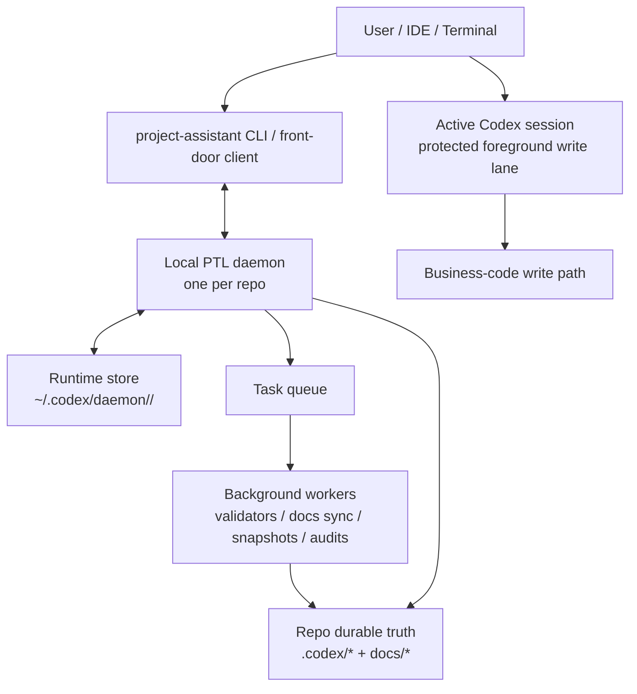
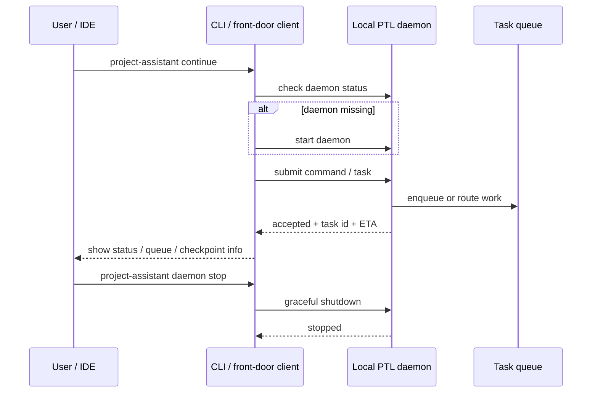

# PTL Daemon MVP

[English](ptl-daemon-mvp.md) | [中文](ptl-daemon-mvp.zh-CN.md)

## Purpose

This note defines the first shippable daemon-backed upgrade for `project-assistant`.

It is intentionally narrower than the full daemon vision:

`ship a version that makes coding faster first, then validate the existing feature set on top of that new baseline.`

## Product Goal

The MVP should solve one immediate user problem:

`stop the skill from interrupting active coding with synchronous support work.`

It also has to preserve the higher-level product goal:

`keep human attention on requirements, direction, boundaries, and tradeoffs while pushing more process detail, doc scaffolding, and support control into the tooling layer.`

## MVP Boundaries

### Included

- one local persistent PTL daemon
- one protected foreground write lane
- one or more background task lanes
- queue state, ETA, and checkpoint reporting
- daemon ownership of safe support-work families
- fast paths for templated and pre-generated doc scaffolds
- cancel, retry, and pause
- fallback to the current non-daemon path

### Excluded

- autonomous background business-code writes
- multi-writer scheduling
- cross-host daemon coordination
- automatic conflict resolution between code-writing tasks

## Runtime Components

| Component | Responsibility |
| --- | --- |
| PTL daemon runtime | long-lived scheduler and event loop |
| task queue | tracks lifecycle, ETA, priority, and checkpoint policy |
| foreground gate | protects the single main write lane |
| background workers | run safe support tasks |
| checkpoint router | returns results to the user and durable truth at the right time |
| runtime store | keeps transient daemon state separate from durable project truth |
| template scaffold pack | generates and incrementally refreshes doc scaffolds so the workflow does not start from zero each time |

## Where The Daemon Runs

Proposed v1 placement:

- local only
- one daemon per repo/workspace
- not a cloud service
- not shared across multiple machines

Recommended layout:

- daemon process: on the user's local machine
- durable project truth: inside the repo under `.codex/*` and docs
- daemon runtime state: outside durable repo truth, for example `~/.codex/daemon/<repo-id>/`

This means the daemon is a local runtime companion, not the source of truth.

## Architecture Diagram

## Who Starts It

Recommended v1 policy:

- explicit start is supported: `project-assistant daemon start`
- auto-start is also allowed on the first daemon-backed command such as `continue`, `progress`, `retrofit`, or `queue`
- the CLI/front-door client is responsible for checking whether the daemon is already alive

So in practice:

1. the user or IDE issues a `project-assistant` command
2. the CLI checks for the repo-local daemon
3. if missing, it starts the daemon
4. the command is then sent to that daemon

## Who Stops It

Recommended v1 policy:

- explicit stop: `project-assistant daemon stop`
- safety stop: `project-assistant daemon kill`
- optional idle timeout: the daemon may shut itself down after a configurable idle window

The user stays in control. Auto-stop is a convenience, not the only shutdown path.

## How The User Talks To It

The user should not talk to the daemon through raw sockets or a hidden protocol.

The proposed interaction surface is:

- `project-assistant daemon start`
- `project-assistant daemon status`
- `project-assistant daemon stop`
- `project-assistant queue`
- normal `project-assistant continue|progress|retrofit|handoff`

Those commands act as thin clients.

They talk to the daemon through a local control channel, preferably:

- Unix domain socket on macOS/Linux
- named pipe equivalent on Windows

Recommended repo-scoped socket example:

- `~/.codex/daemon/<repo-id>/ptl.sock`

## Lifecycle Diagram

## What The Daemon May Touch In V1

Important boundary:

- the daemon may run safe support-work families
- the active coding session keeps the protected business-code write lane
- background business-code writes are out of scope for the first release
- doc-scaffold generation may run in the background, but only on low-risk documentation surfaces

So the daemon helps the worker; it does not replace the worker.

## First Daemon-Managed Task Families

1. validators
2. progress / handoff / snapshot generation
3. docs sync
4. control-surface refresh
5. benchmark / audit tasks
6. templated doc-scaffold generation and incremental refresh

## Queue Contract

Each task should carry at least:

- `task_id`
- `task_type`
- `lane`
- `status`
- `eta_band`
- `owner`
- `touched_paths`
- `checkpoint_policy`
- `last_event`

## User Contract

The MVP should let the user:

- keep coding while background-capable work runs
- inspect queue status quickly
- see ETA or duration band
- cancel or retry work
- understand what the daemon is allowed to touch
- stop spending attention on repeat questions like how to start the doc skeleton or how to rebuild the process surfaces

## Validation Order After Shipping

1. queue lifecycle correctness
2. checkpoint reporting correctness
3. continue/progress/handoff compatibility
4. bootstrap/retrofit compatibility
5. validator and docs-system compatibility
6. broader representative-repo regression validation
