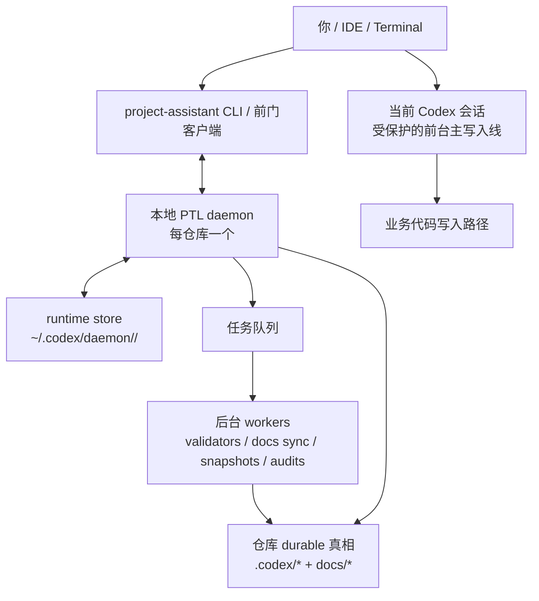
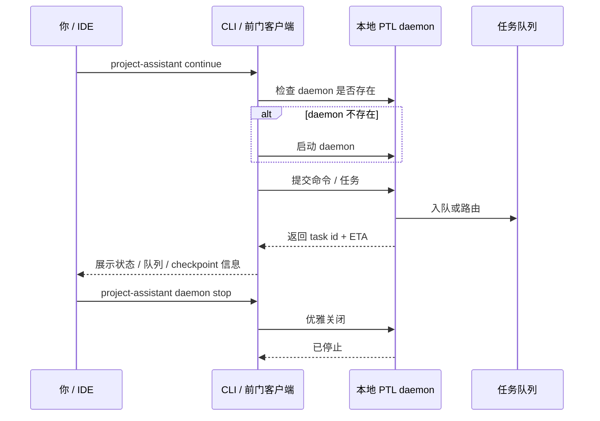

# PTL Daemon MVP

[English](ptl-daemon-mvp.md) | [中文](ptl-daemon-mvp.zh-CN.md)

## 目的

这份说明定义 `project-assistant` 第一版可发出的 daemon 升级形态。

它刻意比“完整 daemon 愿景”更窄：

`先发一版真正能让写代码变快的版本，再在新基线上逐项验证现有功能。`

当前状态：

`M17-M21` 已把这份 MVP 落成当前 daemon-host baseline；后续主线主要是稳定化、dogfooding 和 release 包装，而不是重新回到“要不要做 daemon”的讨论。

## 产品目标

MVP 要先解决一个最直接的问题：

`不要再让 skill 用大量同步支撑任务去打断当前编码主线。`

同时要守住另一个更高层目标：

`让人类更多关注需求、方向、边界和取舍，而把过程细节、文档骨架和支撑性控制更多交给工具层。`

## MVP 边界

### 包含

- 1 个本地常驻 PTL daemon
- 1 条受保护的前台主写入线
- 1 条或多条后台任务线
- 队列状态、ETA 与 checkpoint 回报
- daemon 托管安全支撑任务家族
- 模板化、预生成文档骨架的快路径
- cancel、retry、pause
- 可退回当前非 daemon 路径的 fallback

### 不包含

- 后台自动写业务代码
- 多主写入调度
- 跨宿主 daemon 协同
- 多个代码写入任务之间的自动冲突解决

## 运行时组件

| 组件 | 职责 |
| --- | --- |
| PTL daemon runtime | 常驻调度器与事件循环 |
| task queue | 跟踪生命周期、ETA、优先级与 checkpoint 策略 |
| foreground gate | 保护单一主写入线 |
| background workers | 运行安全支撑任务 |
| checkpoint router | 在合适时间把结果回给用户和 durable 真相 |
| runtime store | 保存瞬时 daemon 状态，并与 durable 项目真相分离 |
| template scaffold pack | 快速生成和增量刷新文档骨架，避免每次从零构造 |

## daemon 运行在哪里

建议的 v1 放置方式是：

- 只跑在本机
- 每个仓库 / workspace 一个 daemon
- 不上云
- 不跨多台机器共享

推荐分层：

- daemon 进程：跑在你的本地机器上
- durable 项目真相：继续留在仓库里的 `.codex/*` 和 docs
- daemon 运行时状态：不写进 durable 真相，而是放在类似 `~/.codex/daemon/<repo-id>/` 的本地 runtime store

也就是说，daemon 是本地运行时伴随层，不是新的 source of truth。

## 总体结构图

## 谁启动它

建议 v1 同时支持两种方式：

- 显式启动：`project-assistant daemon start`
- 自动拉起：第一次执行 daemon 路径相关命令时，由 CLI 自动 ensure

也就是：

1. 你或 IDE 发出 `project-assistant` 命令
2. CLI 先检查这个仓库对应的 daemon 是否存在
3. 如果不存在，就先启动它
4. 然后再把命令交给它

## 谁关闭它

建议 v1 支持：

- 显式关闭：`project-assistant daemon stop`
- 强制关闭：`project-assistant daemon kill`
- 可选 idle timeout：空闲一段时间后自动退出

控制权仍在用户手里；自动关闭只是便利，不应成为唯一关闭方式。

## 你怎么和它对话

你不应该直接通过裸 socket 或隐藏协议和 daemon 交互。

建议的对话面是：

- `project-assistant daemon start`
- `project-assistant daemon status`
- `project-assistant daemon stop`
- `project-assistant queue`
- 普通 `project-assistant continue|progress|retrofit|handoff`

这些命令本质上都是 daemon 的 thin client。

它们通过本地控制通道和 daemon 通信，优先建议：

- macOS / Linux: Unix domain socket
- Windows: named pipe 等价物

其中 `project-assistant daemon status` 不应只显示 runtime 是否在跑；它也应该是宿主和操作员读取“当前检查点 / 下一动作”的标准入口。

推荐的 repo 级 socket 例子：

- `~/.codex/daemon/<repo-id>/ptl.sock`

## 生命周期图

## v1 中 daemon 允许碰哪些东西

这个边界必须非常明确：

- daemon 可以跑安全支撑任务家族
- 当前活跃编码会话继续持有业务代码主写入线
- 首版不允许后台自动写业务代码
- 文档模板骨架生成可以后台执行，但应限制在低风险文档面

所以 daemon 的角色是“帮 worker 清掉支撑性阻塞”，不是“接管 worker 写业务代码”。

## 首批 daemon 托管任务家族

1. validators
2. progress / handoff / snapshot 生成
3. docs sync
4. control-surface refresh
5. benchmark / audit 任务
6. 模板化文档骨架生成与增量刷新

## 队列契约

每个任务至少要带这些字段：

- `task_id`
- `task_type`
- `lane`
- `status`
- `eta_band`
- `owner`
- `touched_paths`
- `checkpoint_policy`
- `last_event`

## 用户契约

MVP 至少要让用户做到：

- 后台任务跑着时，自己还能继续写代码
- 可以快速看到队列状态
- 可以看到 ETA 或时长档位
- 可以 cancel / retry
- 可以清楚知道 daemon 允许碰哪些范围
- 不需要把注意力花在“文档骨架从哪里开始写、过程面该怎么搭”这些重复问题上

## 发版后的验证顺序

1. 队列生命周期是否正确
2. checkpoint 回报是否正确
3. continue/progress/handoff 兼容性
4. bootstrap/retrofit 兼容性
5. validator 与 docs-system 兼容性
6. 代表性仓库上的更广泛回归验证
