# Roadmap

[English](roadmap.md) | [中文](roadmap.zh-CN.md)

## Scope

This roadmap describes the evolution of the `project-assistant` skill itself. It does not replace current execution truth from `.codex/status.md`.

Detailed execution queue:

- [project-assistant/development-plan.md](reference/project-assistant/development-plan.md)

## Now / Next / Later

| Horizon | Focus | Exit Signal |
| --- | --- | --- |
| Now | use the full layered model on more repos, collect rollout friction, and keep strategy / program / delivery surfaces aligned | M12 is closed, and rollout evidence starts replacing internal-only milestone guessing |
| Next | decide whether rollout evidence warrants a new post-M12 milestone or selective backlog re-entry | the next named milestone comes from repeated rollout friction, not from internal guesswork |
| Later | selective M8/M9 carryover only when rollout evidence justifies it | supporting backlog stays bounded until real adoption evidence says otherwise |

## Milestones

| Milestone | Status | Goal | Depends On | Exit Criteria |
| --- | --- | --- | --- | --- |
| [M1](reference/project-assistant/development-plan.md#m1) | done | establish `.codex` control surface and tiering | core skill routing | current state is recoverable |
| [M2](reference/project-assistant/development-plan.md#m2) | done | establish convergent retrofit | control-surface scripts | retrofit no longer stops midway |
| [M3](reference/project-assistant/development-plan.md#m3) | done | establish progress and handoff workflows | module layer + snapshot scripts | progress and handoff are stable |
| [M4](reference/project-assistant/development-plan.md#m4) | done | establish durable-doc standards and doc validation | document standards + docs scripts | durable docs pass structural gates |
| [M5](reference/project-assistant/development-plan.md#m5) | done | establish bilingual public-doc switching and validation | i18n rules + i18n validator | public docs switch cleanly between English and Chinese |
| [M6](reference/project-assistant/development-plan.md#m6) | done | shift to an embedded architect-assistant operating model | previous milestones | planning, execution, architecture supervision, and devlog capture are default-on behaviors |
| [M7](reference/project-assistant/development-plan.md#m7) | done | improve narrative quality and automated architecture triggers | [M6](reference/project-assistant/development-plan.md#m6) | less manual cleanup after retrofit and fewer direction-correction prompts |
| [M8](reference/project-assistant/development-plan.md#m8) | deferred | locale-aware internal control-surface output | handoff + command templates + validation policy | becomes a bounded supporting backlog topic under M10 instead of the mainline |
| [M9](reference/project-assistant/development-plan.md#m9) | deferred | slim continue/resume snapshots without losing recoverability | continue snapshot + handoff + validation policy | becomes a bounded supporting backlog topic under M10 instead of the mainline |

## Strategic Layer Milestones

| Milestone | Status | Goal | Depends On | Exit Criteria |
| --- | --- | --- | --- | --- |
| [M10](reference/project-assistant/development-plan.md#m10) | done | add a strategic-evaluation layer above execution and retrofit | [M7](reference/project-assistant/development-plan.md#m7) + approved strategic direction | the system can produce durable strategy judgments, track when governance/architecture tracks should be inserted, and keep business-direction changes gated to humans |
| [M11](reference/project-assistant/development-plan.md#m11) | done | add a program-orchestration layer across multiple slices or workers | [M10](reference/project-assistant/development-plan.md#m10) + durable program board | the system can coordinate multiple related slices without constant human continuation prompts |
| [M12](reference/project-assistant/development-plan.md#m12) | done | add supervised long-run delivery | [M11](reference/project-assistant/development-plan.md#m11) + stable escalation policy | long-running delivery can continue until a real business decision point instead of stopping for routine steering |

## Milestone Flow

```mermaid
flowchart LR
    M1["M1 Control Surface"] --> M2["M2 Convergent Retrofit"]
    M2 --> M3["M3 Progress + Handoff"]
    M3 --> M4["M4 Document Standards"]
    M4 --> M5["M5 Public Doc I18n"]
    M5 --> M6["M6 Embedded Architect Assistant"]
    M6 --> M7["M7 Better Narrative + Triggers"]
    M7 --> M10["M10 Strategic Evaluation"]
    M10 --> M11["M11 Program Orchestration"]
    M11 --> M12["M12 Supervised Long-Run Delivery"]
```

## Risks and Dependencies

- document sync can scaffold structure faster than it can rewrite polished prose
- default-on architecture supervision must stay high-level first; too much local detail would weaken its value
- long execution lines must stop at real checkpoints, not drift into opaque background work
- public-doc bilingual quality still depends on good content generation, not only file-pair checks
- exact context-usage thresholds still require runtime support
- locale-aware internal output and slimmer continue still matter, but now as bounded supporting backlog under M10 rather than as the mainline
- strategy surfaces must stay evidence-backed and must not auto-change business direction
- program orchestration should not arrive before the strategy layer has a stable review contract
- any post-M12 milestone should emerge from repeated rollout friction, not by reopening already-closed layers without evidence

## Strategic Direction

| Topic | Why It Matters | Current Position |
| --- | --- | --- |
| business planning and program orchestration | `project-assistant` has now closed M10 strategic evaluation, M11 program orchestration, and M12 supervised long-run delivery; the current focus is rollout / friction collection, while M8/M9 remain bounded supporting backlog topics | active in roadmap and development plan |

Direction document:

- [Strategic Planning And Program Orchestration Direction](reference/project-assistant/strategic-planning-and-program-orchestration.md)
