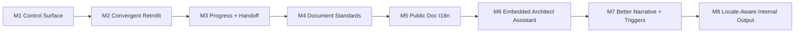

# Roadmap

[English](roadmap.md) | [中文](roadmap.zh-CN.md)

## Scope

This roadmap describes the evolution of the `project-assistant` skill itself. It does not replace current execution truth from `.codex/status.md`.

Detailed execution queue:

- [project-assistant/development-plan.md](reference/project-assistant/development-plan.md)

## Now / Next / Later

| Horizon | Focus | Exit Signal |
| --- | --- | --- |
| Now | locale-aware internal control-surface output | Chinese-first workflows carry less redundant English without weakening public-doc bilingual support or AI restore accuracy |
| Next | slimmer continue snapshots without losing recoverability | `project assistant continue` becomes a smaller restore surface and stops duplicating progress content |
| Later | richer validation, better recovery automation, and more visual reporting | new repos need fewer manual steering prompts and fewer override commands |

## Milestones

| Milestone | Status | Goal | Depends On | Exit Criteria |
| --- | --- | --- | --- | --- |
| [M1](reference/project-assistant/development-plan.md#m1) | done | establish `.codex` control surface and tiering | core skill routing | current state is recoverable |
| [M2](reference/project-assistant/development-plan.md#m2) | done | establish convergent retrofit | control-surface scripts | retrofit no longer stops midway |
| [M3](reference/project-assistant/development-plan.md#m3) | done | establish progress and handoff workflows | module layer + snapshot scripts | progress and handoff are stable |
| [M4](reference/project-assistant/development-plan.md#m4) | done | establish durable-doc standards and doc validation | document standards + docs scripts | durable docs pass structural gates |
| [M5](reference/project-assistant/development-plan.md#m5) | done | establish bilingual public-doc switching and validation | i18n rules + i18n validator | public docs switch cleanly between English and Chinese |
| [M6](reference/project-assistant/development-plan.md#m6) | done | shift to an embedded architect-assistant operating model | previous milestones | planning, execution, architecture supervision, and devlog capture are default-on behaviors |
| [M7](reference/project-assistant/development-plan.md#m7) | done | improve narrative quality and automated architecture triggers | [M6](reference/project-assistant/development-plan.md#m6) | less manual cleanup after retrofit and fewer direction-correction prompts |
| [M8](reference/project-assistant/development-plan.md#m8) | active | evaluate locale-aware internal control-surface output | handoff + command templates + validation policy | Chinese-only workflows can suppress redundant English without weakening public-doc bilingual support |
| [M9](reference/project-assistant/development-plan.md#m9) | later | slim continue/resume snapshots without losing recoverability | continue snapshot + handoff + validation policy | `project assistant continue` carries only minimal restore state and does not duplicate progress content |

## Milestone Flow

## Risks and Dependencies

- document sync can scaffold structure faster than it can rewrite polished prose
- default-on architecture supervision must stay high-level first; too much local detail would weaken its value
- long execution lines must stop at real checkpoints, not drift into opaque background work
- public-doc bilingual quality still depends on good content generation, not only file-pair checks
- exact context-usage thresholds still require runtime support
- locale-aware internal output should not leak into public docs or weaken bilingual release expectations
- `continue` snapshots are useful but still heavier than ideal; they should converge toward minimal restore state rather than a second mini-dashboard

## Strategic Follow-Up

| Topic | Why It Matters | When To Revisit |
| --- | --- | --- |
| business planning and program orchestration | evaluate whether `project-assistant` should add a higher-level planner / supervising role that can decide how the project should evolve next, when governance or architecture side-tracks should be inserted, whether earlier milestones or project positioning need to change, and how to keep humans focused on business direction instead of constant manual steering | after M8 and M9 close; discuss first, review the proposal, then turn it into a formal milestone or development-plan item |
