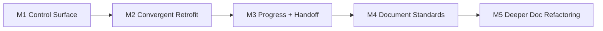

# Roadmap

## Scope

这个 roadmap 只描述 `project-assistant` skill 自身的演进方向，不承担当前执行状态职责。

## Now / Next / Later

| Horizon | Focus | Exit Signal |
| --- | --- | --- |
| Now | 收敛整改、进展、交接、文档系统脚本 | 控制面与文档系统双校验稳定可用 |
| Next | 提升文档整改质量与 README/架构重组能力 | 在真实项目上减少手工补充 |
| Later | 更强的自动恢复、更多验收规则、更多可视化 | 新项目能更少依赖临时提示 |

## Milestones

| Milestone | Status | Goal | Depends On | Exit Criteria |
| --- | --- | --- | --- | --- |
| M1 | done | 建立 `.codex` 控制面与项目分级 | core skill routing | 可恢复当前状态 |
| M2 | done | 建立收敛式 retrofit | control-surface scripts | `整改` 不停在中间态 |
| M3 | done | 建立模块级 progress 与 handoff | module layer + progress scripts | `进展` 和 `压缩上下文` 可用 |
| M4 | active | 建立 durable docs 标准与文档门禁 | document standards + docs scripts | 文档整改可脚本验收 |
| M5 | next | 提升文档重组质量与更强模板应用 | M4 | 更少手工重排 README / docs |

## Milestone Flow

## Risks and Dependencies

- 当前文档整改脚本更擅长补标准结构，不擅长完整重写已有复杂 README
- 若未来要支持真正的 `60% context` 自动提示，需要运行时暴露上下文指标
