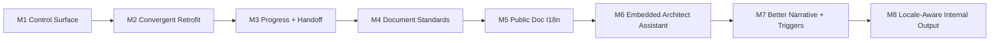

# Roadmap

[English](roadmap.md) | [中文](roadmap.zh-CN.md)

## Scope

This roadmap describes the evolution of the `project-assistant` skill itself. It does not replace current execution truth from `.codex/status.md`.

## Now / Next / Later

| Horizon | Focus | Exit Signal |
| --- | --- | --- |
| Now | embedded architect-assistant automation, default devlog capture, and checkpoint-based execution lines | the user can mostly provide direction while the assistant plans, supervises, executes, validates, and documents by default |
| Next | deeper doc refactoring quality and stronger automated architecture triggers | less manual steering after retrofit and more reliable high-level review |
| Later | richer validation, better recovery automation, and more visual reporting | new repos need fewer manual steering prompts and fewer override commands |

## Milestones

| Milestone | Status | Goal | Depends On | Exit Criteria |
| --- | --- | --- | --- | --- |
| M1 | done | establish `.codex` control surface and tiering | core skill routing | current state is recoverable |
| M2 | done | establish convergent retrofit | control-surface scripts | retrofit no longer stops midway |
| M3 | done | establish progress and handoff workflows | module layer + snapshot scripts | progress and handoff are stable |
| M4 | done | establish durable-doc standards and doc validation | document standards + docs scripts | durable docs pass structural gates |
| M5 | done | establish bilingual public-doc switching and validation | i18n rules + i18n validator | public docs switch cleanly between English and Chinese |
| M6 | active | shift to an embedded architect-assistant operating model | previous milestones | planning, execution, architecture supervision, and devlog capture are default-on behaviors |
| M7 | next | improve narrative quality and automated architecture triggers | M6 | less manual cleanup after retrofit and fewer direction-correction prompts |
| M8 | later | evaluate locale-aware internal control-surface output | handoff + command templates + validation policy | Chinese-only workflows can suppress redundant English without weakening public-doc bilingual support |

## Milestone Flow

## Risks and Dependencies

- document sync can scaffold structure faster than it can rewrite polished prose
- default-on architecture supervision must stay high-level first; too much local detail would weaken its value
- long execution lines must stop at real checkpoints, not drift into opaque background work
- public-doc bilingual quality still depends on good content generation, not only file-pair checks
- exact context-usage thresholds still require runtime support
- locale-aware internal output should not leak into public docs or weaken bilingual release expectations
