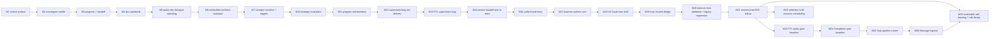

# Roadmap

[English](roadmap.md) | [中文](roadmap.zh-CN.md)

## Scope

This roadmap describes the evolution of the `project-assistant` skill itself. It does not replace the live execution truth in `.codex/status.md`.

For the detailed execution queue, see:

- [project-assistant/development-plan.md](reference/project-assistant/development-plan.md)

## Overall Progress
| Item | Current Value |
| --- | --- |
| Overall Progress | 5 / 5 execution tasks complete |
| Current Phase | `release packaging prep active` |
| Active Slice | `package-daemon-host-baseline-for-release` |
| Current Objective | prepare the daemon-host baseline for release-facing installation and update paths |
| Active Slice Exit Signal | 用户可以通过明确版本入口获取 daemon-host baseline，而不是只依赖当前仓库 mainline |
| Clear Next Move | Current execution tasks are complete; move to the next slice |
| Next Candidate Slice | `future-host-expansion-and-m15-evidence` |

See the detailed execution plan: [project-assistant/development-plan.md](reference/project-assistant/development-plan.md)

## Current / Next / Later
| Horizon | Focus | Exit Signal |
| --- | --- | --- |
| Current | prepare the daemon-host baseline for release-facing installation and update paths | 用户可以通过明确版本入口获取 daemon-host baseline，而不是只依赖当前仓库 mainline |
| Next | 只在 daemon-host baseline 已稳定、dogfooding 证据充分后，再判断是否扩大到更强宿主表面或重新讨论 `M15 | 有足够证据支持下一条更大的主线，而不是靠猜测扩范围 |
| Later | 建立 daemon runtime、runtime store、queue/event contract，以及最小的 `start/status/stop/queue` 控制面 | 已完成并成为 daemon-host baseline 的基础层 |

## Milestone Rules
- one milestone = one clear theme-level goal
- `done` means the milestone is actually complete
- do not split the same work theme across multiple top-level milestones
- put sub-steps in the development plan, not in overlapping roadmap rows

## Milestones

| Milestone | Status | Goal | Depends On | Exit Criteria |
| --- | --- | --- | --- | --- |
| [M1](reference/project-assistant/development-plan.md#m1) | done | establish `.codex` control surfaces and project tiering | core skill routing | current state is recoverable |
| [M2](reference/project-assistant/development-plan.md#m2) | done | establish convergent retrofit | control-surface scripts | retrofit no longer stops halfway |
| [M3](reference/project-assistant/development-plan.md#m3) | done | establish progress and handoff workflows | module layer + snapshot scripts | progress and handoff are stable |
| [M4](reference/project-assistant/development-plan.md#m4) | done | establish durable doc standards and doc validation | document standards + docs scripts | durable docs pass structure gates |
| [M5](reference/project-assistant/development-plan.md#m5) | done | establish public-doc bilingual switching and acceptance | i18n rules + i18n validator | public docs switch cleanly between English and Chinese |
| [M6](reference/project-assistant/development-plan.md#m6) | done | converge on the embedded architect-assistant operating model | previous milestones | planning, execution, architecture supervision, and devlogs are default capabilities |
| [M7](reference/project-assistant/development-plan.md#m7) | done | improve narrative quality and automatic architecture triggers | [M6](reference/project-assistant/development-plan.md#m6) | less manual cleanup and fewer direction corrections after retrofit |
| [M8](reference/project-assistant/development-plan.md#m8) | deferred | optimize internal control-surface output by language | handoff + command templates + validation policy | continues as bounded supporting backlog |
| [M9](reference/project-assistant/development-plan.md#m9) | deferred | compress continue / resume / handoff snapshots without losing recoverability | continue snapshot + handoff + validation policy | continues as bounded supporting backlog |
| [M10](reference/project-assistant/development-plan.md#m10) | done | add a strategic-evaluation layer above execution | [M7](reference/project-assistant/development-plan.md#m7) + approved strategic direction | the system emits durable strategic judgment and still leaves direction changes to human approval |
| [M11](reference/project-assistant/development-plan.md#m11) | done | add program orchestration across slices/executors | [M10](reference/project-assistant/development-plan.md#m10) + durable program board | the system coordinates related slices instead of depending on repeated human “continue” prompts |
| [M12](reference/project-assistant/development-plan.md#m12) | done | add supervised long-run delivery | [M11](reference/project-assistant/development-plan.md#m11) + stable escalation policy | long-running delivery can continue to real business decision points |
| [M13](reference/project-assistant/development-plan.md#m13) | done | add the PTL-driven supervision loop | [M12](reference/project-assistant/development-plan.md#m12) + durable delivery supervision | PTL can inspect, continue, re-sequence, or escalate periodically or by event |
| [M14](reference/project-assistant/development-plan.md#m14) | done | add worker handoff and re-entry | [M13](reference/project-assistant/development-plan.md#m13) + durable handoff / supervision truth | `when a worker stops, the project does not stop` becomes durable capability |
| [M15](reference/project-assistant/development-plan.md#m15) | later | add selective multi-executor scheduling only for safe parallel work | [M14](reference/project-assistant/development-plan.md#m14) + disjoint write scopes + conflict control | real multi-executor work is only allowed when write scopes and return paths are explicit |
| [M16](reference/project-assistant/development-plan.md#m16) | done | add the unified hard entry and tool front door | [M14](reference/project-assistant/development-plan.md#m14) + versioned control surface + entry scripts | old repos auto-upgrade first and `continue / progress / handoff` no longer fall back to free prose first |
| [M17](reference/project-assistant/development-plan.md#m17) | done | build the PTL daemon runtime core and write-safe fast-path baseline | [M16](reference/project-assistant/development-plan.md#m16) + daemon-first architecture + runtime contract | the daemon runtime, queue/event contract, runtime store, and minimum CLI control surface are usable |
| [M18](reference/project-assistant/development-plan.md#m18) | done | build the VS Code host shell and live-status surfaces | [M17](reference/project-assistant/development-plan.md#m17) + daemon event contract | users can see queue state, status, the active slice, and recent events in VS Code |
| [M19](reference/project-assistant/development-plan.md#m19) | done | build the host continue-resume bridge so `resume-ready` becomes a host action | [M18](reference/project-assistant/development-plan.md#m18) + Codex runner / command contract | `manual continue` and conservative `one-click continue` work without chat-box injection |
| [M20](reference/project-assistant/development-plan.md#m20) | done | validate the daemon-host baseline on local workspaces and re-validate older feature families on top of it | [M19](reference/project-assistant/development-plan.md#m19) + representative local workspaces | the daemon-host baseline is stable and older capabilities keep passing on the new baseline |
| [M21](reference/project-assistant/development-plan.md#m21) | done | resume post-M16 rollout verification on top of the daemon-host baseline | [M20](reference/project-assistant/development-plan.md#m20) | representative legacy repos still upgrade first, render structured panels, and are no longer dominated by avoidable synchronous work |
| [M22](reference/project-assistant/development-plan.md#m22) | done | add reviewable correction-driven self-learning and a stable rule library | [M18](reference/project-assistant/development-plan.md#m18) + [M19](reference/project-assistant/development-plan.md#m19) + a host-neutral registry root | repeated corrections become pending candidates, the host and Status Bar support explicit review, and accepted rules persist without reinstall loss |
| [M23](reference/project-assistant/development-plan.md#m23) | done | build the PTL policy gate baseline so other projects auto-generate policy and run preflight | [M13](reference/project-assistant/development-plan.md#m13) + [M16](reference/project-assistant/development-plan.md#m16) + PTL role document | `continue / progress` output PTL signal and fixtures cover generic, missing-control, style-engine-like, and openclaw-skills-like scenarios |
| [M24](reference/project-assistant/development-plan.md#m24) | done | build the no-known-required-next-step completion gate so project-assistant cannot leave required work as "next step" and stop | [M16](reference/project-assistant/development-plan.md#m16) + [M23](reference/project-assistant/development-plan.md#m23) + closeout stop taxonomy | final-check, open-task, final-answer next-step, explicit-deferral, and human-decision fixtures produce stable completion decisions |
| [M25](reference/project-assistant/development-plan.md#m25) | done | build the programmatic Task Pipeline Runner so every non-trivial execution is enqueued before runner-controlled next-task / repair / return / stop | [M16](reference/project-assistant/development-plan.md#m16) + [M23](reference/project-assistant/development-plan.md#m23) + [M24](reference/project-assistant/development-plan.md#m24) | command-loop, repair-loop, llm-pause, run-argument-enqueue, human-decision, and entry-panel fixtures produce stable pipeline states |
| [M26](reference/project-assistant/development-plan.md#m26) | done | build the host/message ingress layer so every host/user message can enter the programmatic task loop by default | [M25](reference/project-assistant/development-plan.md#m25) + unified front door + entry panels | execution-message, discussion-message, classify-only, front-door, and entry-panel fixtures produce stable message-ingress states |

## Milestone Flow

```mermaid
flowchart LR
    M1["M1 control surface"] --> M2["M2 convergent retrofit"]
    M2 --> M3["M3 progress + handoff"]
    M3 --> M4["M4 doc standards"]
    M4 --> M5["M5 public-doc bilingual switching"]
    M5 --> M6["M6 embedded architect assistant"]
    M6 --> M7["M7 stronger narrative + triggers"]
    M7 --> M10["M10 strategic evaluation"]
    M10 --> M11["M11 program orchestration"]
    M11 --> M12["M12 supervised long-run delivery"]
    M12 --> M13["M13 PTL supervision loop"]
    M13 --> M14["M14 worker handoff and re-entry"]
    M14 --> M16["M16 unified hard entry"]
    M16 --> M17["M17 daemon runtime core"]
    M17 --> M18["M18 VS Code host shell"]
    M18 --> M19["M19 host resume bridge"]
    M19 --> M20["M20 daemon-host validation + legacy regression"]
    M20 --> M21["M21 resume post-M16 rollout"]
    M21 --> M22["M22 reviewable self-learning + rule library"]
    M21 --> M23["M23 PTL policy gate baseline"]
    M23 --> M24["M24 Completion gate baseline"]
    M24 --> M25["M25 Task pipeline runner"]
    M25 --> M26["M26 Message ingress"]
    M26 --> M22
    M21 --> M15["M15 selective multi-executor scheduling"]
```

## Risks and Dependencies

- the daemon-host baseline is now implemented, but release packaging, version entry, and broader dogfooding still need to catch up
- the first host bridge is intentionally the VS Code extension frontend; “type continue into an existing chat box” should not become the main architecture
- `M15` still applies only to safe parallel work; if tasks touch the same files, control surfaces, or abstraction boundaries, they should stay on one primary write line
- `M8 / M9` remain important, but they stay bounded as supporting backlog instead of reclaiming the mainline
- any future web / remote host support needs new runtime, transport, and trust-boundary design instead of reusing desktop-local assumptions blindly

## Behavior Backlog

| Topic | Why It Matters | Current Position |
| --- | --- | --- |
| daemon-host baseline hardening and dogfooding | `M17-M21` are complete, but retention will depend on whether the baseline stays fast and stable in real use | active / current mainline |
| issue-driven closure loop | when a durable problem is identified, the skill should eventually auto-run the chain `devlog -> architecture -> roadmap/development plan -> long implementation run` | supporting backlog / todo |
| reviewable correction-learning loop | repeated user corrections should become reviewable candidates, host/status-bar prompts, and promotable stable rules instead of remaining trapped inside chat history | supporting backlog / candidate next slice |
| automatic PTL policy gate | projects entering `continue / progress` should auto-generate project policy, load domain packs, and output PTL signal | baseline delivered / host review pending |
| Completion gate against stop-too-early behavior | known required next steps should not be left in the final answer; the run must continue, block, require human decision, or be explicitly deferred | baseline delivered / default closeout gate |
| Programmatic task pipeline loop | non-trivial execution requests must first become pipeline tasks, with the runner owning next-task, repair, return-to-mainline, and stop decisions | baseline delivered / default execute gate |
| Message ingress baseline | host/user messages must enter message ingress before LLM work so ordinary chat can be classified, recorded, enqueued, and run through the programmatic loop | baseline delivered / host bridge hardening pending |
| control-truth synchronization determinism | when users run `project assistant continue`, `.codex/status.md`, `.codex/plan.md`, `strategy / program-board / delivery / PTL / handoff`, and `continue / progress / handoff` should stop feeling out of sync | supporting backlog / todo |
| stronger host surfaces | Webview dashboards, chat participants, and web/remote hosts should be built only after the daemon-host baseline is trusted | later / supporting backlog |

## Strategic Direction

| Topic | Why It Matters | Current Position |
| --- | --- | --- |
| daemon-first async execution, host resume bridge, and latency governance | the original latency complaint is now embodied in a working baseline: daemon runtime, host live status, and continue bridge ship together; the next job is to make that path stable and adoptable | active in roadmap and development plan |
| business planning and program orchestration | `project-assistant` has completed the PTL-centered `M10 / M11 / M12 / M13 / M14 / M16` layers; `M15` remains an evidence-gated later layer | active in roadmap and development plan |
| reviewable self-learning and rule library | repeated user corrections should become reviewable artifacts, host-visible review prompts, and accepted stable rules that survive reinstall instead of hidden model drift | supporting backlog / candidate next slice |
| PTL policy gate baseline | PTL responsibilities are now documented; the first implementation step is policy sync + preflight at other-project entry points, preparing later review and registry work | delivered as M23 baseline |
| Completion gate baseline | project-assistant should no longer leave known required next steps for the user to chase; final / closeout must first pass the no-known-required-next-step gate | delivered as M24 baseline |
| Task pipeline runner baseline | control flow should no longer depend on LLM willingness to continue; LLM acts inside bounded tasks while the runner owns loop progress | delivered as M25 baseline |
| Message ingress baseline | ordinary host/user messages should not bypass the runner; message ingress records and classifies each message before enqueueing pipeline work | delivered as M26 baseline |
| issue-driven closure loop | when a durable problem is identified, the skill should eventually auto-trigger `devlog -> architecture -> roadmap/development plan -> long implementation run` rather than depending on repeated human prompts | supporting backlog / todo |

Direction docs:

- [Strategic Planning And Program Orchestration](reference/project-assistant/strategic-planning-and-program-orchestration.md)
- [Host Resume Bridge And VS Code Feasibility](reference/project-assistant/host-resume-bridge.md)
- [Correction-Driven Self-Learning](reference/project-assistant/correction-driven-self-learning.md)
