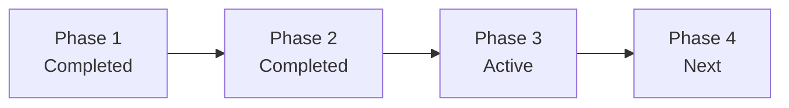
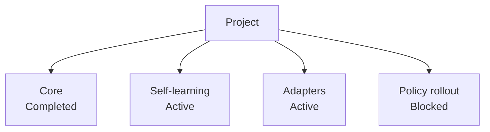
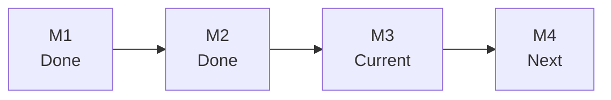

# Progress Reporting

Use this reference when the user asks:

- project progress
- current state
- where are we now
- what is done / in progress / next
- milestone status
- subproject status

## Source Priority

Build the answer from these sources in order:

1. `.codex/status.md`
2. `.codex/brief.md`
3. `.codex/plan.md`
4. `.codex/module-dashboard.md` and `.codex/modules/*.md` for large projects
5. `.codex/subprojects/*.md` for active or blocked areas
6. roadmap documents
7. tests, evals, audits, and generated reports as evidence

If the top three are missing, say the project lacks a reliable control surface and fall back to the best available docs with that caveat.

If `scripts/progress_snapshot.py` exists, run it first to generate a quick machine-checked control-surface summary.

If the session is visibly long or the user is losing track, suggest:

- `项目助手 压缩上下文`

Use `scripts/context_handoff.py` for that when available.

## Required Output Shape

Use a table-first layout for every project. Prefer tables whenever the content naturally has fields. Keep lists only for short command sets or when a table would be clearly worse.

Use this layout for medium and large projects:

```md
## 一眼总览
- 当前阶段:
- 当前切片:
- 当前执行线:
- 架构信号:
- 当前主要风险:

## 当前位置
- 阶段路线图:
- 当前切片路线图:

## 当前系统能做什么
- README 能力来源:
- Roadmap 对应位置:
- 已可直接使用:

## 全局模块进展
| 模块 | 优先级 | 当前状态 | 完成度 | 已有能力 | 剩余步骤 | 下一检查点 |
| --- | --- | --- | --- | --- | --- | --- |

## 模块位置图
```mermaid
flowchart TB
```

## 横切工作流
| 工作流 | 当前切片 | 下一检查点 |
| --- | --- | --- |

## 接下来要做的事
1.
2.
3.
```

For `medium` projects, prefer a maintainer-oriented view instead of pretending the repo has a large-project module map. That means:

- merge "当前定位" and "当前位置" into one main table
- explain the current slice in plain Chinese first, then keep the raw slice name as a precise label
- add a small terminology table when the current slice uses internal terms such as `dashboard`, `triage`, `continuity`, or `watchdog`
- prefer a `工作域视角` table over a fake module table
- keep the AI-facing truth in `.codex/*`, but render a human-facing explanation layer on top of it

For `large` projects:

- keep the module view
- still use table-first rendering for summary, current position, current long task, architecture supervision, capabilities, control abilities, and next actions
- keep Mermaid as a secondary orientation aid, not the primary carrier of progress truth
- add one human-language judgment row so maintainers can understand the current battlefield before reading module details

For small projects, compress this into a short paragraph plus `Next 3 Actions`.

## Mermaid Templates

### Phase Flow



### Workstream Map



### Milestone Ladder



## Concision Rules

- report only active, blocked, or recently completed workstreams
- for large projects, include the key modules even if they are not active, when that improves orientation
- prefer one meaningful Mermaid diagram over several partial diagrams
- avoid repeating roadmap prose
- convert detailed evidence into one-line conclusions
- if confidence is low because the status docs are stale, say so in one line
- prefer Chinese-first labels when the current user is interacting in Chinese
- when possible, give clickable roadmap positions for the current phase and active slice
- show module priority as `P0-P4`, where `P0` is the current main battlefield and `P4` is maintenance/watch mode
- for medium projects, optimize for "future maintainer returns to the repo", not only for external readers or AI-internal terminology

## Trust Rules

Prefer this order of trust:

1. current status docs
2. current tests and evals
3. roadmap and durable docs
4. historical reports

Never present an old roadmap statement as current execution truth unless it is confirmed by the status layer or recent evidence.
