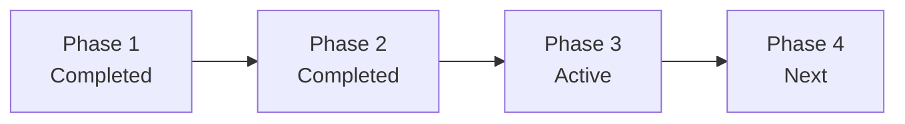
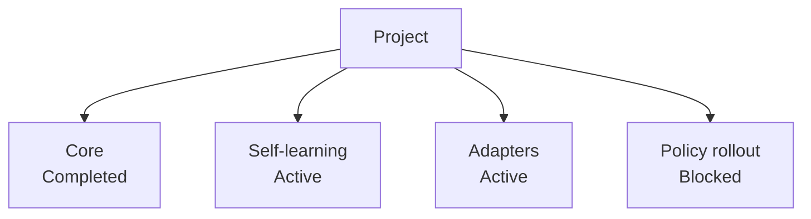
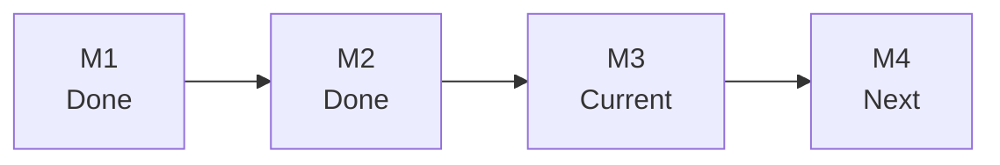

# Progress Reporting

Use this reference when the user asks:

- project progress
- current state
- where are we now
- what is done / in progress / next
- milestone status
- subproject status

## Source Priority

Build the answer from these sources in order:

1. `.codex/status.md`
2. `.codex/brief.md`
3. `.codex/plan.md`
4. `.codex/subprojects/*.md` for active or blocked areas
5. roadmap documents
6. tests, evals, audits, and generated reports as evidence

If the top three are missing, say the project lacks a reliable control surface and fall back to the best available docs with that caveat.

## Required Output Shape

Use this layout for medium and large projects:

```md
## Summary
- Overall:
- Current phase:
- Active slice:
- Main risk:

## Global View
| Area | Status | Current focus | Exit condition |
| --- | --- | --- | --- |

## Subprojects
| Subproject | Status | Current focus | Next checkpoint |
| --- | --- | --- | --- |

## Evidence
- Tests:
- Evals / reports:

## Next 3 Actions
1.
2.
3.
```

For small projects, compress this into a short paragraph plus `Next 3 Actions`.

## Mermaid Templates

### Phase Flow



### Workstream Map



### Milestone Ladder



## Concision Rules

- report only active, blocked, or recently completed workstreams
- avoid repeating roadmap prose
- convert detailed evidence into one-line conclusions
- if confidence is low because the status docs are stale, say so in one line

## Trust Rules

Prefer this order of trust:

1. current status docs
2. current tests and evals
3. roadmap and durable docs
4. historical reports

Never present an old roadmap statement as current execution truth unless it is confirmed by the status layer or recent evidence.
